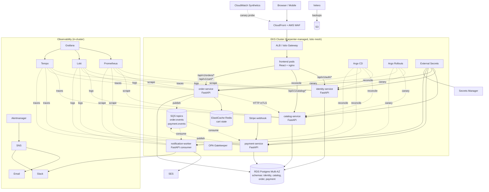

# ShopForge — Microservices on AWS, Production-Grade DevOps Portfolio

> **Goal:** Refactor this e-commerce app from a modular monolith into a **microservices architecture** and wrap it with production-grade DevOps tooling covering every major domain — CI/CD, IaC, Kubernetes, GitOps, service mesh, progressive delivery, full DevSecOps, observability (metrics/logs/traces), chaos engineering, DR, and developer experience.
>
> **Owner:** Full-stack developer with 4 years IT experience, transitioning to AWS DevOps / Cloud Engineer roles.
> **Timeline:** 5–7 weeks at ~1–2 hrs/day (~80–100 hours total)
> **Estimated AWS spend:** ~$50–65 total (most resources run only during the 5–7 day live-demo window)

---

## 🛡 Honesty & Interview-Integrity Rules

Non-negotiable. These exist so you can defend every line on your resume.

1. **No fabricated metrics.** RPS, p95, deploy time, cost — all from *your* measurements on this project. Never copy generic numbers.
2. **No claimed feature you haven't built.** If we skip a phase, it doesn't appear on the resume.
3. **Understand before claiming.** Every tool comes with a "why this, what problem, what alternative rejected" note. If you can't explain it in 30 seconds, we slow down.
4. **No copied dashboards or configs without comprehension.** Point at any panel — explain its query.
5. **Resume bullets are written at the END of each phase** using YOUR numbers and observations, not the placeholder templates in §4.
6. **"Did you build this alone?"** Honest answer: "I designed and built it with AI pair-programming; I reviewed and understood every line I committed." More credible than overclaiming.

The example resume bullets in §4 are **templates**, not facts. Every `<placeholder>` is for *your* measurement.

---

## 1. Architecture Overview

### 1.1 Why microservices?

The monolith already had natural seams (auth, catalog, cart, order, payment domains as separate modules). Decomposing along those seams gives a *real* microservices story to talk about in interviews, not a fake one.

**Defensible interview answer:** *"I split along bounded contexts where the data ownership was already clean. Identity owns users + auth. Catalog owns products + reviews. Order owns cart + orders. Payment owns Stripe interactions and is isolated for PCI scope reasons. I kept these four sync services + one async notification worker because adding more services without a real load reason would have been complexity theatre."*

### 1.2 Services (4 sync + 1 async)

| Service | Responsibility | DB Schema | Comms in | Comms out |
|---|---|---|---|---|
| `identity-service` | auth, users, addresses, JWT signing | `identity` | HTTPS from frontend | — |
| `catalog-service` | categories, products, reviews | `catalog` | HTTPS from frontend, internal from order | — |
| `order-service` | cart, orders, order state | `order` | HTTPS from frontend, **Redis** for cart | HTTPS → catalog (validate product), **SQS** → payment, **SQS** → notification |
| `payment-service` | Stripe payment intents, webhook | `payment` | **SQS** events from order, HTTPS Stripe webhook | **SQS** → order (payment.succeeded/failed), **SQS** → notification |
| `notification-worker` | async email/Slack on order events | — (stateless) | **SQS** events | SES (email), Slack webhook |

### 1.3 Database strategy

**One RDS Postgres instance, schema-per-service.** Each service has its own Alembic migrations under its own `schema_name`. **No service touches another service's schema** — only via the owning service's API or via events.

**Why not separate RDS instances?** At this traffic level it would be wasteful (~$15-25/month extra) without giving us any isolation benefit a schema doesn't. *In an interview:* "schema isolation gives me 80% of the benefit; physical separation only matters at higher load or stricter compliance — that would be a Phase 2 migration."

### 1.4 Inter-service communication

- **Sync HTTP/REST** for read paths (e.g., order-service asks catalog-service "is this product still in stock?"). Internal traffic stays inside the K8s cluster, secured by Istio mTLS.
- **Async via Amazon SQS** for events. The order creation flow is a **saga**:

```
1. POST /orders → order-service creates order in "PENDING_PAYMENT" state
2. order-service publishes OrderCreated event → SQS
3. payment-service consumes OrderCreated → creates Stripe PaymentIntent
4. (Customer completes payment) → Stripe webhook → payment-service
5. payment-service publishes PaymentSucceeded event → SQS
6. order-service consumes PaymentSucceeded → marks order PAID
7. notification-worker consumes both events → sends emails
8. (Compensation) If payment fails → PaymentFailed event → order-service marks CANCELLED → release stock
```

This is a real saga with a real compensation path. **Excellent interview material.**

### 1.5 Architecture diagram



---

## 2. DevOps Domain Coverage Map

Every column you'd see on a senior DevOps job description is covered:

| Domain | Tool / Service |
|---|---|
| Source control | Git, Conventional Commits, semantic versioning |
| Continuous Integration | GitHub Actions (matrix across **5 services**, cache, parallel) |
| Code quality | ruff, eslint, prettier, pre-commit, hadolint |
| Testing | pytest, vitest, Playwright (e2e), k6 (load), **Pact (contract)**, terratest |
| **DevSecOps — SAST** | Bandit, Semgrep |
| **DevSecOps — DAST** | OWASP ZAP nightly |
| **DevSecOps — SCA** | Dependabot, Trivy fs |
| **DevSecOps — Container** | Trivy + Grype, distroless images |
| **DevSecOps — IaC scan** | tfsec, checkov, kube-linter, kubescape |
| **DevSecOps — Secret scan** | gitleaks, trufflehog |
| **DevSecOps — SBOM** | syft (CycloneDX) per service |
| **DevSecOps — Signing** | cosign (keyless OIDC) per service |
| **DevSecOps — Policy** | OPA / Gatekeeper |
| Containerization | Docker multi-stage, distroless, non-root |
| Registry | ECR (5 repos, immutable tags, scan-on-push) |
| IaC | Terraform (modules, remote state, terratest, drift) |
| Cost governance | Infracost in CI, Kubecost in cluster |
| Cloud platform | AWS: VPC, ALB, RDS, ElastiCache, **SQS**, **SES**, CloudFront, WAF, KMS, Secrets Manager, SNS, S3, Route 53/nip.io |
| Orchestration | EKS + Karpenter |
| Package mgmt | Helm umbrella chart + per-service subchart, Kustomize overlays |
| Config mgmt | External Secrets Operator |
| **GitOps** | Argo CD (one Application per service + app-of-apps) |
| **Service mesh** | Istio (mTLS strict, AuthorizationPolicy per service) |
| Network policy | Calico |
| TLS | cert-manager + ACM |
| **Progressive delivery** | Argo Rollouts canary per service |
| Auto-scaling | HPA + VPA + Karpenter |
| **Backup / DR** | Velero + RDS PITR |
| Monitoring | Prometheus |
| Visualization | Grafana (RED/USE, **service-graph**, SLO panels) |
| Logging | Loki + Fluent Bit |
| **Tracing** | Tempo + OpenTelemetry — traces fan across all 5 services |
| Alerting | Alertmanager → SNS → Email + Slack |
| SLI / SLO | Sloth-generated recording rules |
| Synthetic monitoring | CloudWatch Synthetics |
| **Chaos engineering** | Chaos Mesh — service-aware experiments |
| Load testing | k6 (results in Grafana) |
| Incident management | Runbooks, on-call simulation |
| **Documentation as code** | MkDocs Material → GitHub Pages, ADRs |
| Developer experience | Conventional commits, auto changelog, PR templates, OpenAPI-generated TS SDK |

---

## 3. Phases Overview

| # | Phase | Days | Output |
|---|---|---|---|
| 0 | App hardening — fix bugs in current monolith | 1–2 | Stable baseline |
| 1 | **Microservices extraction** | 7–10 | 4 services + 1 worker, schemas split, SQS events, contract tests |
| 2 | Container excellence + supply chain security | 3–4 | Signed distroless images, SBOMs, ECR push |
| 3 | Full DevSecOps CI/CD (matrix across 5 services) | 4–5 | 5 quality gates × 5 services, OIDC to AWS |
| 4 | Terraform multi-environment infrastructure | 5–6 | Dev/staging/prod, all AWS resources, Infracost |
| 5 | EKS + GitOps + Istio + Argo Rollouts | 7–9 | Live cluster, mesh mTLS, canary deploys |
| 6 | LGTM observability + distributed tracing | 4–5 | Service graph, SLO dashboards, alerts |
| 7 | Chaos engineering + game day | 3–4 | Chaos Mesh experiments, recorded game day |
| 8 | DR + load test + docs site + demo video | 4–5 | k6 results, MkDocs site, Loom video, `terraform destroy` |

**Total: ~40–50 working days** at 1-2 hr/day = ~5–7 weeks.

---

## 4. Example Resume Bullets — Templates To Aim For

⚠️ Templates only. Each placeholder is for *your* measurement. Only claim phases you actually ship.

1. **Designed and shipped a 5-service microservices e-commerce platform on AWS EKS** (identity, catalog, order, payment, notification-worker) with **Istio mTLS** mesh, **Argo CD GitOps** workflow, and **Argo Rollouts canary deploys per service** — zero-downtime deploys with automatic rollback on SLO breach.
2. **Implemented event-driven order saga** across order/payment/notification services via **Amazon SQS** with compensation on payment failure; designed Pydantic-modeled, versioned event contracts.
3. **Authored 12+ Terraform modules** (VPC, EKS, RDS Multi-AZ, ElastiCache, SQS, SES, CloudFront + WAF, KMS, Secrets Manager, IRSA, GitHub OIDC); enforced via tfsec/checkov/tflint/terratest with **Infracost** PR comments.
4. **Built a DevSecOps CI/CD pipeline in GitHub Actions** with **matrix builds across 5 services**: SAST (Semgrep, Bandit), SCA (Trivy fs + Dependabot), container scan (Trivy + Grype), DAST (OWASP ZAP nightly), IaC scan (tfsec, checkov, kube-linter, kubescape) — every image **signed with cosign** and shipped with a CycloneDX SBOM.
5. **Implemented LGTM observability stack** (Loki, Grafana, Tempo, Mimir-Prom) with **OpenTelemetry distributed tracing across all 5 services**, custom SLO dashboards (`<your %>` availability, p95 < `<your ms>`), and multi-burn-rate alerts routed to SNS + Slack.
6. **Validated reliability via Chaos Mesh experiments** (pod kill, network delay, CPU pressure) and **k6 load tests at `<your X>` RPS sustained**; identified `<your bottleneck>` and resolved via `<your fix>`, improving p95 by `<your Y>%`.
7. **Authored DR runbook with Velero K8s backup + RDS PITR**, validated restore drill — achieved RPO ≤ `<your N>` min, RTO ≤ `<your N>` min.
8. **Owned platform docs**: conventional-commit semantic versioning, automated changelog, ADR catalog, MkDocs Material site on GitHub Pages, OpenAPI-generated TypeScript SDK for frontend.

---

## 5. Phase 0 — App Hardening (1–2 days)

Stabilize the monolith *before* slicing it. Slicing buggy code into 5 services gives you 5 buggy services.

- [ ] Multi-stage `frontend/Dockerfile` (currently dev server in "prod")
- [ ] Remove `SECRET_KEY` default — fail-fast at startup
- [ ] Transactional stock decrement (`SELECT … FOR UPDATE`) in `order_service.py`
- [ ] Conditional OpenAPI docs (`docs_url=None` when `ENV=prod`)
- [ ] CORS origins required, no `["*"]` fallback
- [ ] Fix JWT `type` claim check
- [ ] Stripe webhook: signature errors → 400, never swallowed
- [ ] `/health` (liveness) + `/ready` (readiness) endpoints
- [ ] `structlog` JSON output with correlation IDs
- [ ] Idempotency-key support on order create

**Outcome:** Monolith is bug-free baseline for the extraction.

---

## 6. Phase 1 — Microservices Extraction (7–10 days)

The biggest, most interesting phase. Done right, it's the centerpiece of your interview narrative.

### 6.1 New repo layout

```
.
├── services/
│   ├── identity-service/
│   │   ├── app/                # FastAPI app
│   │   ├── alembic/            # owns "identity" schema migrations
│   │   ├── tests/
│   │   ├── Dockerfile
│   │   ├── pyproject.toml
│   │   └── openapi.json        # generated, committed
│   ├── catalog-service/
│   ├── order-service/
│   ├── payment-service/
│   └── notification-worker/
├── libs/
│   └── shopforge-events/       # shared Pydantic event models (private package or copy-paste — discuss)
├── frontend/                   # React (existing)
├── infra/...                   # Phase 4
├── gitops/...                  # Phase 5
├── observability/...           # Phase 6
├── tests/
│   ├── contract/               # Pact contracts between consumer/provider services
│   ├── e2e/                    # Playwright across all services
│   └── load/                   # k6
└── docs/
```

### 6.2 Extraction order (lowest risk first)

1. **identity-service** (most isolated — almost no inbound dependencies)
2. **catalog-service** (read-heavy, isolated)
3. **payment-service** (clean Stripe boundary)
4. **order-service** (last because it depends on the others)
5. **notification-worker** (greenfield, no extraction needed — new code)

### 6.3 Per-service standard

Each service must have:
- Own `Dockerfile` (distroless final stage)
- Own `pyproject.toml` (no shared `requirements.txt`)
- Own Alembic migrations under its schema
- Own `/health` (liveness — just `200 OK`) and `/ready` (readiness — checks DB, optionally SQS)
- OpenAPI spec generated and committed (CI fails if drift)
- Own `tests/` with ≥ 70% coverage gate
- Own integration tests with **testcontainers-python** (real Postgres + LocalStack for SQS)

### 6.4 Event contracts (`libs/shopforge-events`)

Pydantic v2 models with `event_version: Literal[1]` and `event_id: UUID`. Examples:
- `OrderCreatedV1` (order_id, user_id, line_items, total_cents, idempotency_key)
- `PaymentSucceededV1` (order_id, payment_intent_id, amount_cents)
- `PaymentFailedV1` (order_id, reason)
- `OrderConfirmedV1` (order_id, email)

Decide early: ship the lib as a private Python package on CodeArtifact, OR vendor a copy in each service. For a portfolio, vendoring with a sync script is honest and simpler.

### 6.5 Inter-service patterns

- **Sync HTTP:** order-service calls `GET catalog-service/internal/products/{id}` (note: separate `/internal` route group with IP-restriction + Istio AuthorizationPolicy allowing only `order-service` ServiceAccount).
- **Async SQS:** producers use boto3 SQS client; consumers run a separate `python -m app.consumer` entrypoint as a sidecar Deployment for that service (separate pod from API).
- **Retry / DLQ:** SQS redrive policy (max 5 attempts → dead-letter queue). Alert on DLQ depth > 0.

### 6.6 Contract tests (Pact)

For each sync HTTP edge (order → catalog):
- order-service's test suite generates a "consumer contract" (the requests it makes)
- catalog-service's CI verifies it satisfies all consumer contracts
- Breaking change to catalog API fails CI before merge

Real microservices teams do this. It's an excellent interview talking point.

### 6.7 Local dev story

Updated `docker-compose.yml` brings up:
- 5 services + frontend
- Postgres (multi-schema)
- Redis
- **LocalStack** (mocks SQS + SES locally)
- A simple Traefik or nginx-proxy on port 8080 doing path-based routing

`docker compose up` and your laptop becomes a mini-cluster.

### 6.8 Acceptance

- [ ] All 5 services pass their own tests
- [ ] `docker compose up` runs the full system locally
- [ ] Place an order locally → see order/payment/notification logs flow through
- [ ] Force a payment failure → see saga compensate (order CANCELLED, no email)
- [ ] Contract test catches a deliberate breaking change to catalog API
- [ ] OpenAPI spec for each service is committed and rendered in docs site

**Outcome:** 5 services in 5 folders, all running locally, talking via mTLS-ready HTTP + SQS, with contract tests. *This is what gets you the interview.*

---

## 7. Phase 2 — Container Excellence + Supply Chain (3–4 days)

For each of 5 services:
- Multi-stage Docker build, final = distroless, non-root, read-only FS
- `syft` SBOM (CycloneDX) attached to image
- `cosign sign` keyless via GitHub OIDC
- `trivy image` + `grype` scan, fail on HIGH/CRITICAL
- ECR repo with immutable tags + scan-on-push + lifecycle (keep last 10)

Plus repo-wide:
- `pre-commit`: ruff, prettier, gitleaks, hadolint, conventional-commit lint
- `release-please` for semantic versioning **per service** (each gets its own version)

**Acceptance:** Push to main → 5 signed, scanned, SBOM-attached images in ECR with independent version tags.

---

## 8. Phase 3 — DevSecOps CI/CD (4–5 days)

Matrix CI runs every PR. Each service is one matrix cell.

### Workflows
- `.github/workflows/ci.yml` — runs on every PR
  - **Matrix per service:** `identity, catalog, order, payment, notification-worker`
    - SAST: Bandit, Semgrep
    - SCA: Trivy fs + Dependabot
    - Tests: pytest + testcontainers (real Postgres + LocalStack)
    - **Contract tests** (Pact consumer/provider verification)
    - OpenAPI spec validation (fail if drift)
    - Container build + Trivy + Grype + SBOM + cosign sign
  - Frontend cell: eslint, tsc, vitest, Playwright smoke
  - IaC cell: tfsec, checkov, kube-linter, kubescape
  - Secrets cell: gitleaks, trufflehog
  - PR comment posts full quality gate summary
- `.github/workflows/infra.yml` — terraform plan + infracost on PR, apply on main
- `.github/workflows/security.yml` — nightly DAST (OWASP ZAP against staging)
- `.github/workflows/release.yml` — semantic-release per service

### Quality
- GitHub OIDC → IAM role (zero static AWS keys)
- Branch protection: required reviews, required checks, signed commits
- CODEOWNERS per service folder
- PR + issue templates

**Acceptance:** A demo PR with 5 different problems (SQL injection, hardcoded key, vulnerable dep, broken contract, misconfigured tf) blocks at 5 distinct gates.

---

## 9. Phase 4 — Terraform Multi-Environment (5–6 days)

### Modules (`infra/terraform/modules/`)
- `vpc` — 2 AZs, public/private/intra, single NAT, VPC flow logs
- `eks` — managed cluster, IRSA, Karpenter
- `rds` — Postgres 16, Multi-AZ, KMS, PITR, 4 schemas seeded by app migrations
- `elasticache` — Redis (single shard)
- `ecr` — 5 repos (one per service)
- `sqs` — order.events, payment.events, notification.events + per-queue DLQ
- `ses` — verified sender domain for notification-worker
- `cloudfront` — distribution + ACM cert
- `waf` — managed rule groups
- `secrets` — Secrets Manager + KMS
- `iam` — service roles, GitHub OIDC role, **IRSA roles per service** (each service gets its own IAM role with least-privilege: e.g., order-service can write to `order.events` only, not `payment.events`)
- `sns` — alert topic
- `s3` — assets, tf state, Velero, flow logs

### Environments
`infra/terraform/environments/{dev,staging,prod}/` sharing modules, different tfvars.

### Quality
- `tflint`, `tfsec`, `checkov` in CI
- `terratest` for `vpc` + `eks` + `iam` modules
- `terraform-docs` auto-generated READMEs
- **Infracost** in PR
- Drift detection cron workflow

**Acceptance:** `terraform apply` from zero → working VPC + EKS + RDS + ElastiCache + 3 SQS queues + IRSA per service. `terraform destroy` clean.

**Cost during build:** ~$5 (NAT + brief RDS) — `destroy` between sessions.

---

## 10. Phase 5 — EKS + GitOps + Istio + Argo Rollouts (7–9 days)

### Platform bootstrap (Terraform-applied, one-time)
- EKS 1.30 with Karpenter
- AWS Load Balancer Controller, EBS CSI driver, metrics-server
- cert-manager
- External Secrets Operator
- **Istio** — strict mTLS mesh-wide
- **Calico** NetworkPolicy
- **OPA Gatekeeper** with constraints: deny `:latest`, deny privileged, require resource limits, require liveness probe
- **Argo CD** + **Argo Rollouts** + **Argo Workflows**
- **Velero** → S3
- **Kubecost**

### Application layer (Helm umbrella chart)
- `infra/helm/shopforge/` — umbrella chart
  - subchart per service: `identity`, `catalog`, `order`, `payment`, `notification-worker`, `frontend`
  - Each subchart has: Deployment + Service + HPA + PDB + ServiceAccount (annotated for IRSA) + ServiceMonitor (Prom scrape) + AuthorizationPolicy (Istio) + Rollout (instead of Deployment for sync services)
- Kustomize overlays for `dev/staging/prod`

### Per-service security
- **Istio AuthorizationPolicy:** explicit allow lists. e.g., catalog-service accepts requests only from `frontend` and `order-service` ServiceAccounts.
- **Per-service IRSA:** order-service's IAM role only has `sqs:SendMessage` on `order.events.fifo` and `sqs:ReceiveMessage` on the payment-response queue. Nothing else.

### GitOps repo
- `gitops/apps/<service>.yaml` — Argo CD Application per service
- `gitops/infra/` — platform components
- CI's `deploy.yml` bumps a service's image tag in `gitops/apps/<service>.yaml` → Argo CD reconciles → Rollout starts canary

### Progressive delivery per service
Each sync service has its own Rollout with AnalysisTemplate querying Prometheus for that service's error rate. Canary: 10% → 50% → 100% with auto-rollback. **Each service rolls out independently** — the centerpiece microservices story.

### Acceptance
- Live HTTPS URL → CloudFront → WAF → ALB → Istio gateway → frontend
- `kubectl exec` into one service, `curl` another → see Istio mTLS headers
- Deploy a bad image of payment-service → that service auto-rollbacks (order/catalog unaffected)
- Try to deploy a Pod with `runAsUser: 0` → Gatekeeper denies
- Show in K9s/Lens: every pod has a sidecar, every connection mTLS

**Cost during 5-day demo window:** ~$25 (EKS + nodes + ALB + NAT + ElastiCache + small SQS spend).

---

## 11. Phase 6 — Observability (LGTM + tracing across services) (4–5 days)

### Install
- `kube-prometheus-stack`
- `loki-stack` + Fluent Bit
- `tempo`
- (Optional) Mimir for long-term Prom

### Per-service instrumentation
- `prometheus-fastapi-instrumentator` → `/metrics` (RED metrics)
- `opentelemetry-instrumentation-fastapi` + `opentelemetry-instrumentation-botocore` + `-sqlalchemy` + `-requests`
  - **B3 / W3C trace context propagation** across HTTP + SQS
- `structlog` JSON with `trace_id` injection

### Frontend
- OpenTelemetry Web SDK → ALB → Tempo
- Browser RUM (Core Web Vitals)

### Dashboards (committed JSON)
- **Service graph** — Istio + Tempo derived (this is the visually impressive one for demos)
- **RED per service**
- **Saga health** — order events vs payment events vs notification events; lag in SQS
- **USE** for nodes
- **SLO dashboard** — 99.9% availability + p95 < 300ms per service, error-budget burn

### Alerts (Alertmanager)
- High error rate per service
- High latency per service
- SQS DLQ depth > 0 (saga compensation needed)
- SQS consumer lag > 60s (notification-worker stuck)
- Pod crash-looping
- RDS high CPU / low storage
- Certificate expiring soon
- **Multi-window multi-burn-rate SLO alerts** (Google SRE methodology)

### Synthetic monitoring
CloudWatch Synthetics canary every 5 min: full register → browse → cart → checkout flow. Tests every service path.

**Acceptance:** Open Grafana → see traffic flowing across all 5 services. Click a slow trace → see it span order → catalog → SQS → payment → notification with timings. Trigger a payment failure → alert with link to trace within 5 min.

---

## 12. Phase 7 — Chaos Engineering + Game Day (3–4 days)

Service-aware experiments via Chaos Mesh:
- `pod-kill` against payment-service → observe order-service retries via SQS visibility timeout
- `network-delay` 500ms on catalog-service → order-service degrades gracefully (cached read)
- `cpu-stress` on a node → Karpenter scales out, pods rebalance
- `dns-chaos` → verify DNS retry behaviour
- **Network partition** order-service ↔ payment SQS endpoint → events queue up, recover when restored
- **Drop messages** in SQS → DLQ alerting fires

Run a **game day exercise**: pick one chaos scenario, do it live, follow the runbook, document timing and findings in `docs/CHAOS_DRILLS.md`. Record video.

This is *senior* interview material — most candidates have never done this on their own project.

---

## 13. Phase 8 — DR + Load test + Docs + Demo (4–5 days)

### Backup / DR
- Velero scheduled hourly → S3
- RDS automated snapshots + **manual restore drill on a fresh dev env**
- `docs/DR_RUNBOOK.md` with real RPO/RTO numbers from your drill
- Per-service runbooks for common incidents

### Load test
- k6 from external EC2 (so the test host isn't your laptop) → ALB
- Realistic journey: register → browse → cart → checkout
- Publish to Grafana via Prometheus remote-write
- Identify the bottleneck → fix → re-run → publish before/after numbers
- `docs/LOAD_TEST_RESULTS.md`

### Docs site
- MkDocs Material → GitHub Pages
- Mermaid architecture
- ADRs: "Why these 4 services + 1 worker", "Why schema-per-service", "Why Istio over Linkerd", "Why GitOps", "Why SQS over Kafka"
- Per-service docs from OpenAPI
- Runbooks
- "How I built this" narrative

### Demo asset
- **8–10 min Loom**: commit → 5-cell matrix CI gates → image signed → GitOps reconciles → Argo Rollouts canary on payment-service → Grafana service graph lights up → trigger chaos experiment → see saga handle it → run k6 → see numbers → Kubecost dashboard → `terraform destroy`
- Screenshot library in `docs/images/`
- README revamp: badges, diagram, live URL (while up), demo video link

**Final step:** Capture everything, then `terraform destroy`. Stop billing.

---

## 14. Cost Budget

| Item | Estimate |
|---|---|
| GitHub Actions (public repo) | $0 |
| ECR storage (5 repos × small) | <$3 |
| RDS db.t3.micro (free tier) | $0 |
| ElastiCache cache.t3.micro × 5 days | ~$3 |
| EKS control plane × 7 days | ~$17 |
| EC2 spot nodes (3-4) × 7 days | ~$7 |
| NAT Gateway × 7 days | ~$8 |
| ALB × 7 days | ~$4 |
| CloudFront + WAF | <$3 |
| SQS (3 queues + DLQs) | <$1 |
| SES (test emails) | <$1 |
| S3 (state + Velero + logs) | <$2 |
| CloudWatch Synthetics + Logs | <$3 |
| Data transfer + misc | <$3 |
| **Total** | **~$55** |

**Cost-saving levers:** spot nodes, single-AZ NAT, `nip.io` instead of Route 53, `terraform destroy` between sessions.

---

## 15. Target Repository Layout

```
.
├── .github/
│   ├── workflows/{ci,infra,deploy,security,release}.yml
│   ├── CODEOWNERS
│   ├── PULL_REQUEST_TEMPLATE.md
│   └── dependabot.yml
├── services/
│   ├── identity-service/{app,alembic,tests,Dockerfile,pyproject.toml,openapi.json}
│   ├── catalog-service/...
│   ├── order-service/...
│   ├── payment-service/...
│   └── notification-worker/...
├── libs/
│   └── shopforge-events/        # shared Pydantic event schemas
├── frontend/                    # React + nginx
├── infra/
│   ├── terraform/
│   │   ├── modules/{vpc,eks,rds,elasticache,ecr,sqs,ses,cloudfront,waf,secrets,iam,sns,s3}/
│   │   └── environments/{dev,staging,prod}/
│   ├── helm/shopforge/          # umbrella chart with 6 subcharts (5 services + frontend)
│   └── kustomize/overlays/{dev,staging,prod}/
├── gitops/
│   ├── apps/                    # Argo CD Applications (1 per service)
│   ├── infra/                   # platform components
│   └── rollouts/                # AnalysisTemplates
├── observability/
│   ├── grafana/dashboards/
│   ├── prometheus/{rules,alerts}/
│   └── slo/
├── chaos/                       # Chaos Mesh experiments
├── tests/
│   ├── contract/                # Pact contracts
│   ├── load/k6-checkout.js
│   └── e2e/playwright/
├── docs/                        # MkDocs source
│   ├── architecture/
│   ├── adrs/
│   ├── runbooks/
│   └── images/
├── mkdocs.yml
├── .pre-commit-config.yaml
├── docker-compose.yml           # local dev (5 services + Postgres + Redis + LocalStack)
├── DEVOPS_PLAN.md               # this file
└── README.md
```

---

## 16. Suggested 6-Week Cadence (extendable to 7)

| Week | Focus |
|---|---|
| **Week 1** | Phase 0 (bug fixes) + start Phase 1 (extract identity-service) |
| **Week 2** | Finish Phase 1 (catalog, payment, order, notification, contract tests, local docker-compose works end-to-end) |
| **Week 3** | Phase 2 (containers + supply chain) + Phase 3 (DevSecOps CI/CD) |
| **Week 4** | Phase 4 (Terraform multi-env) |
| **Week 5** | Phase 5 (EKS + GitOps + Istio + Argo Rollouts) — go live mid-week |
| **Week 6** | Phase 6 (LGTM + tracing) + Phase 7 (chaos) + Phase 8 (DR + load + docs + video) — `terraform destroy` Sunday |

---

## 17. Interview-Ready Talking Points

Be able to talk 2-3 minutes on each, with specifics from your project:

- **"Walk me through your architecture."** 4+1 services, why these boundaries, schema-per-service, why no separate DBs at this scale, saga for order creation.
- **"What happens when a customer places an order?"** Full saga walkthrough including compensation on payment failure.
- **"How do services authenticate to each other?"** Istio mTLS + AuthorizationPolicy per service + per-service IRSA.
- **"What's your CI/CD pipeline?"** Matrix across 5 services, parallel quality gates, signed images, GitOps reconcile, per-service canary with auto-rollback.
- **"What was the hardest thing you debugged?"** Real story from extraction, IRSA permissions, Istio AuthorizationPolicy rejection, trace context propagation across SQS, etc.
- **"How would you scale this to 10× traffic?"** RDS read replicas, ElastiCache cluster mode, separate RDS per service, Kafka for events instead of SQS, multi-region active-active. Show you see the horizon.
- **"What did you cut?"** Service catalog (Backstage), Vault, full polyglot, gRPC. Knowing what you cut is senior signal.
- **"How do you handle a partial outage?"** SQS retry + DLQ + alerts + compensation events. Walk through a real chaos drill you ran.

---

## 18. Working Loop (every phase)

1. **Concept brief (15 min)** — short doc: tools, problem each solves, alternative rejected. You read first.
2. **Detailed sub-plan** — file list, changes. You review.
3. **Implementation** — code + config.
4. **Walk-through** — line by line until you can explain it back unprompted.
5. **Verify it works** — run, screenshot, capture real numbers.
6. **Capture phase artifacts** — *real* resume bullet, screenshots, talking points.
7. **Git commit + green CI**.

If a tool feels confusing, we stop for a learning side-quest.

**Next step:** Phase 0 — app hardening. Say **"start phase 0"** to begin with the concept brief.
