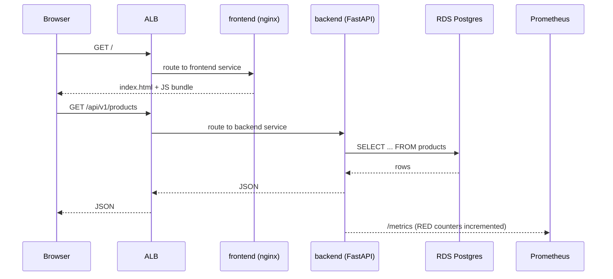

# Architecture

ShopForge runs on a single **EKS 1.30** cluster in `ap-south-1`, fronted by
an **ALB** managed by the AWS Load Balancer Controller, with **RDS
PostgreSQL** as the system of record. Every resource shown below is defined
in Terraform; every Kubernetes object is reconciled by Argo CD from the
`gitops/` directory in this repo.

## System diagram

```mermaid
flowchart TB
    User[Browser]

    subgraph AWS["AWS — ap-south-1"]
        Route53[DNS / ALB hostname]
        ALB[Application Load Balancer<br/>created by AWS LB Controller]
        ECR[(ECR<br/>backend + frontend images)]

        subgraph EKS["EKS Cluster (managed node group)"]
            subgraph NS_shopforge["namespace: shopforge"]
                FE[frontend Pods<br/>React + nginx]
                BE[backend Pods<br/>FastAPI<br/>HPA: 2-10, target CPU 70%]
                ING[Ingress<br/>ALB target]
            end

            subgraph NS_argocd["namespace: argocd"]
                ArgoCD[Argo CD]
            end

            subgraph NS_obs["namespace: observability"]
                Prom[Prometheus]
                Loki[Loki]
                Graf[Grafana]
                SM[ServiceMonitor]
            end

            subgraph NS_chaos["namespace: chaos-mesh"]
                ChaosCtl[Chaos Mesh<br/>controller + daemon + dashboard]
            end

            ING --> FE
            ING --> BE
            SM -.scrape /metrics.-> BE
            Prom <- SM
            Graf --> Prom
            Graf --> Loki
            ChaosCtl -. inject .-> BE
        end

        RDS[(RDS PostgreSQL 16<br/>Single-AZ, db.t3.micro)]
        IAM[IAM + IRSA<br/>per-controller service accounts]
    end

    User --> Route53 --> ALB --> ING
    BE --> RDS
    ECR -.image pull.- EKS

    GH[GitHub] -.OIDC.-> IAM
    GH -.push images.-> ECR
    GH -.image tag bump.-> ArgoCD
    ArgoCD -.reconcile.-> NS_shopforge
```

## Request lifecycle — product listing



## Why these choices

### Why a single cluster, not multi-cluster?

Single EKS cluster is sufficient for a portfolio at this traffic scale. The
*architectural* learning — Argo CD, mesh-free mTLS via TLS at the ALB, IRSA,
Karpenter-ready node group — generalises to multi-cluster. Adding a second
cluster would have multiplied spend without showing a new skill.

### Why RDS Single-AZ, not Multi-AZ?

Cost. Multi-AZ doubles RDS spend and the portfolio's DR story is told
through **PITR + snapshot restore drill** ([DR runbook](dr-runbook.md))
rather than instance-level HA — which is the more interesting story anyway,
because it generalises to region failover.

### Why AWS Load Balancer Controller, not nginx-ingress?

ALB controller is the AWS-native path: ALB integrates with WAF, Cognito,
and ACM out of the box, and target-group health checks map cleanly to pod
readiness. nginx-ingress would still need an NLB or ALB in front of it —
two layers where one will do.

### Why Argo CD, not Flux?

Both are valid. Argo CD's UI is a strong demo artefact for portfolio review
— recruiters can *see* the app-of-apps tree and sync status. Flux's
strengths (multi-tenancy, image automation controllers) don't matter at
one-cluster scale.

### Why Chaos Mesh, not Litmus or Gremlin?

Chaos Mesh installs cleanly on EKS containerd, has a clean dashboard, and
its CRD model (`PodChaos`, `NetworkChaos`, `StressChaos`) maps 1:1 to the
failure modes I wanted to test. Litmus is more ceremony for the same
experiments at this scale. Gremlin is paid.

## What was cut, and why

| Cut | Reason |
| --- | --- |
| Microservices split (5 services) | Original Phase 1 plan; descoped to keep DevOps as the centerpiece rather than a refactor |
| Istio service mesh | mTLS between two services adds operational complexity without portfolio payoff at this scale |
| Multi-region active-active | Cost; the DR runbook covers the *theory* and the snapshot restore proves the muscle |
| Karpenter | Managed node group is sufficient at 2-4 nodes; Karpenter shines at 50+ nodes |
| Backstage / service catalog | One app — no catalog needed |
| Velero K8s backup | Cluster is stateless (all state in RDS); RDS PITR is the actual recovery mechanism |

These are deliberate scope cuts, not gaps. Each is defensible in an
interview: *"I cut it because it would have been complexity theatre at this
scale; here's when I'd add it."*
