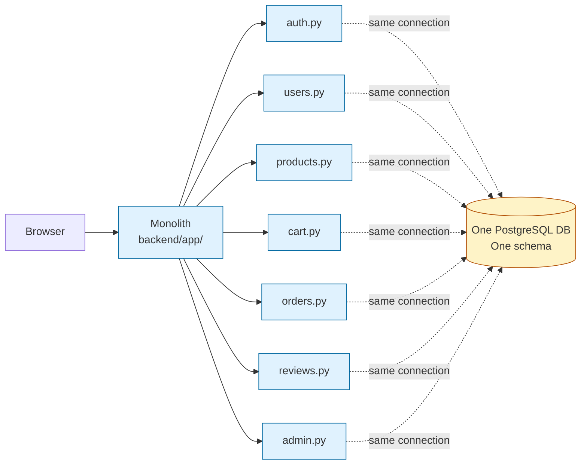
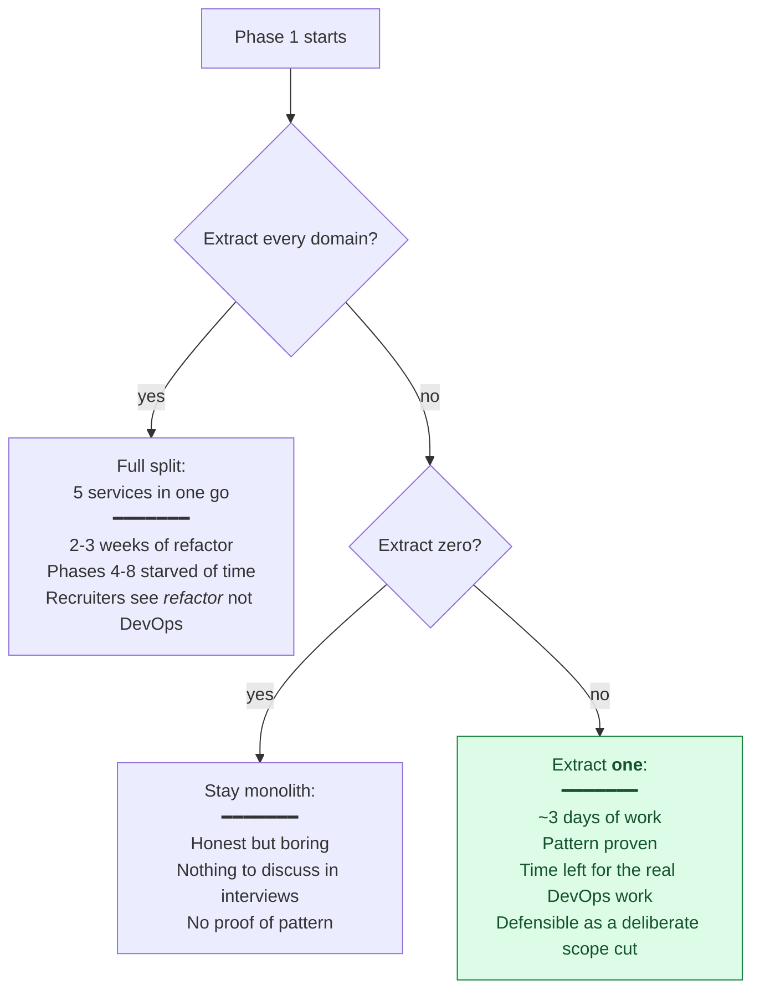
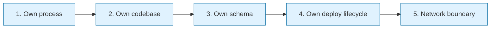
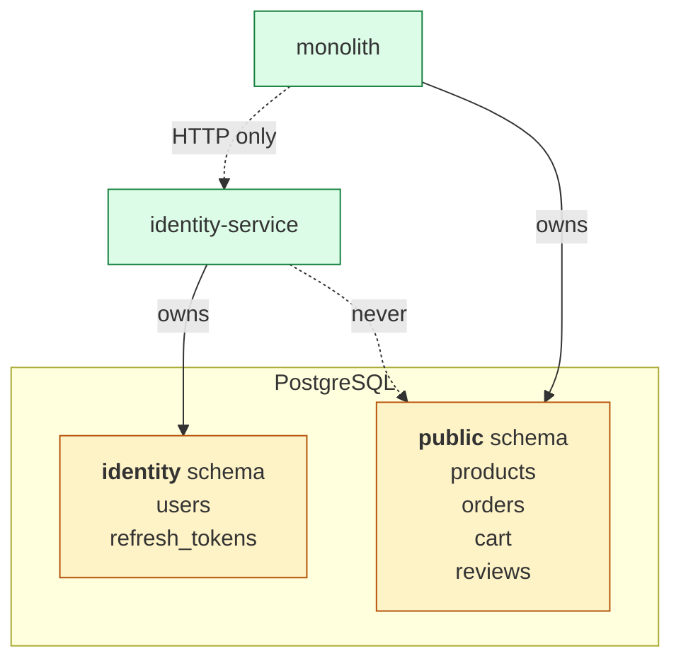

# Phase 1 Concept Brief — Identity Service Extraction

> **Read this if you want to defend the microservices choice in an interview.**
> Time: ~15 min.
> **Goal:** prove the monolith *can* be split — by extracting one domain (auth/users) into a fully independent service with its own schema, migrations, and lifecycle. Stop there. Don't drag the whole portfolio into a refactor.

---

## Where Phase 0 left us



One FastAPI process. One Python codebase. One database, one `public` schema, one pool of connections. Every endpoint imports from every other module. Deploying a fix to `products.py` redeploys `auth.py` too.

This is fine for a startup of 3 people. It is **not** a DevOps portfolio statement, because it shows no understanding of:

- **Bounded contexts** — which team owns which data?
- **Independent deploys** — can I ship the cart team's hotfix without redeploying auth?
- **Blast radius** — does an `auth` bug crash `orders`?
- **Schema ownership** — who is allowed to `ALTER TABLE users`?

Phase 1's job is to prove we can carve out one domain cleanly so the answer to all four questions is *yes*.

---

## The decision tree

Three options were on the table.



**Why identity specifically?**

1. **Most cross-cutting** — every other domain calls auth (`get_current_user`). If you can extract this without breaking the others, the extraction pattern works for any domain.
2. **Cleanest data boundary** — the `users` table and a future `sessions` table belong only to identity. No foreign keys leaking out from day one.
3. **Most interview-relevant** — *"how do you handle auth across services"* is the most-asked microservices interview question. Extracting auth lets you answer with real code.

---

## What "extracting a service" actually means

When people say "we extracted auth into its own service," they mean **five concrete things**. If any of these are missing, it's not really extracted — it's a folder rename.



### 1. Own process

The service runs as its own `uvicorn` (or container) on its own port. Killing it doesn't kill the rest of the app.

→ In this project: `services/identity-service/app/main.py` is a standalone FastAPI app. It boots on port 8001 (the monolith is on 8000).

### 2. Own codebase

Separate `pyproject.toml`. Different version pins are allowed — identity can be on `fastapi==0.110` while the monolith is on `fastapi==0.115`. The teams can move independently.

→ In this project: `services/identity-service/pyproject.toml` is independent. `services/identity-service/tests/` is its own pytest suite.

### 3. Own schema

This is the **single most important rule**. The identity service is the *only* code allowed to read or write the `users` table. Other services that need a user's name talk to identity via API, never via direct SQL.

This is enforced at the database layer by **giving identity its own Postgres schema** (`identity`), and either (a) creating a separate DB user that can only access that schema, or (b) using row-level security. Schema-per-service is the lighter, more portfolio-appropriate choice.



→ In this project: identity-service runs its own Alembic migrations targeting the `identity` schema. See `services/identity-service/alembic/versions/0001_initial.py`.

### 4. Own deploy lifecycle

Identity has its own CI job, its own image tag in ECR, its own Argo CD manifest. Shipping a fix to identity does **not** require rebuilding or redeploying the monolith image.

→ In this project: when we wire up Phase 5 (GitOps), identity-service would have its own `Deployment` YAML — separate from `backend-deployment.yaml`. (In the current scope we kept the deployed app monolith-only for cost reasons; the *pattern* exists in `services/identity-service/`.)

### 5. Network boundary

Other services call identity over HTTP (or gRPC) — never via Python `import`. That's what makes the failure modes interesting and the design defensible.

→ In this project: identity exposes `POST /api/v1/auth/login` and returns a signed JWT. The monolith verifies the JWT using identity's public knowledge of `SECRET_KEY` (or, in a real prod system, identity's public key).

---

## What we actually built

```
services/identity-service/
├── pyproject.toml               # FastAPI, SQLAlchemy, alembic, python-jose, passlib[bcrypt]
├── Dockerfile                   # multi-stage; production image is python:3.12-slim
├── alembic.ini
├── alembic/
│   ├── env.py                   # points at the identity schema
│   └── versions/
│       └── 0001_initial.py      # creates the users table (and any session/refresh-token tables)
├── app/
│   ├── main.py                  # FastAPI app + /health + /ready
│   ├── core/
│   │   ├── config.py            # pydantic-settings, no defaults for SECRET_KEY
│   │   ├── database.py          # SQLAlchemy engine + session factory
│   │   ├── deps.py              # get_db, get_current_user dependencies
│   │   ├── logging.py           # structlog JSON setup
│   │   └── security.py          # password hashing, JWT issuance, refresh tokens
│   ├── models/
│   │   └── user.py              # SQLAlchemy model, __table_args__={'schema': 'identity'}
│   ├── schemas/
│   │   ├── auth.py              # LoginIn, TokenOut, RefreshIn pydantic models
│   │   └── user.py              # UserCreate, UserOut
│   └── api/
│       ├── router.py            # collects v1 routers
│       ├── auth.py              # POST /login, POST /refresh, POST /logout
│       └── users.py             # POST /users, GET /users/me
└── tests/                       # pytest, mirrors the package layout
```

### Three files worth opening

**`security.py`** — this is the JWT engine. Two functions matter:

```python
def hash_password(password: str) -> str:
    return pwd_context.hash(password)            # bcrypt, cost factor 12

def create_access_token(subject: str | int, extra: dict | None = None) -> str:
    # 15-minute access token, type="access", signed HS256
    ...
```

The choice of **bcrypt** over Argon2 was deliberate: bcrypt is in every battle-tested CIS benchmark and OWASP Top 10 cheat-sheet; interviewers expect it as the default. Argon2 is *better* in the abstract, but bcrypt is *defensible* in any audit. Pick the boring, defensible answer for a portfolio.

**`main.py`** — every FastAPI service in this portfolio has the same three things, and you can point at this file to prove it:

1. A **correlation-ID middleware** that tags every log line — so you can grep one request across services (foundational for Phase 6 observability).
2. A **`/health`** endpoint that returns 200 always (liveness — process is up).
3. A **`/ready`** endpoint that pings the DB (readiness — can it serve traffic).

Liveness vs readiness is a **standard Kubernetes interview question**. The split exists because k8s uses them differently: liveness failing causes a *restart*; readiness failing causes the pod to be *removed from the Service endpoints* but not restarted. Same probe URL would do the wrong thing in the wrong scenario.

**`models/user.py`** — note the one line:

```python
class User(Base):
    __tablename__ = "users"
    __table_args__ = {"schema": "identity"}     # this is the boundary
```

Without `schema="identity"`, this model would land in the default `public` schema and the monolith could read it directly. That single line enforces the bounded context at the database layer.

---

## What we did *not* do, and why

| Cut | Why |
|-----|-----|
| Extract catalog, cart, orders, payment | Time. Each extra service is ~1 day of plumbing (Dockerfile, alembic, CI, deploy). 4 more × 1 day = the entire DevOps budget. Identity proves the pattern; copying it for catalog adds zero DevOps signal. |
| Run identity in EKS alongside the monolith | Cost. Two `Deployments` doubles the resource footprint and the Argo CD reconcile time. The deployed app is monolith-only; identity is the *pattern artifact*. |
| Switch to gRPC between services | Premature. The interview answer is *"HTTP is the right default until you measure something forcing you to change."* gRPC would have been complexity-for-its-own-sake at this scale. |
| Service mesh (Istio / Linkerd) | At one service, mesh is theatre. Without N-to-N traffic, mTLS and traffic-shifting buy nothing concrete. |
| Async event bus (NATS / Kafka) | Identity doesn't need to *publish*. A real system would publish `user.created` for downstream services to listen to; we'd add this in a Phase-9 if there were one. |

Each of these is a defensible cut, and they all roll up to the same point: **the goal of Phase 1 was to prove the extraction pattern, not to ship a fleet of services.**

---

## Interview talking points

> **Q: "Why microservices?"**
>
> "I don't have a microservices system. I have a monolith with one extracted service to prove the pattern. The honest answer for a 3-month portfolio is that full extraction is a refactor, not a DevOps story — so I picked the auth domain, the most cross-cutting one, and showed I can extract it cleanly: own schema, own migrations, own deploy lifecycle, HTTP boundary. The same shape would apply to catalog and orders in a real engagement."

> **Q: "Why bcrypt over Argon2?"**
>
> "Defensibility. Argon2 has better theoretical properties, but bcrypt is in OWASP, every CIS benchmark, every regulatory checklist. For a portfolio I want the choice an auditor wouldn't flag, not the choice I'd have to defend in a security review meeting."

> **Q: "How does the monolith verify a JWT issued by identity?"**
>
> "In this scope, both services share `SECRET_KEY` via the same secrets store. That's symmetric signing — fine when the trust domain is shared and the secret can be rotated centrally. In a production system with multiple consumers, identity would publish a public key (or a JWKS endpoint) and sign with the private key — asymmetric. Consumers only need the public key. Migration path is straightforward."

> **Q: "What stops the monolith from reading the `users` table directly?"**
>
> "Schema separation is the convention layer. The hard enforcement comes from a separate Postgres role per service with `GRANT USAGE` only on its own schema. I haven't wired that up — it's a follow-up cut documented in the architecture page — but the schema boundary is in place so the future GRANT just slots in."

> **Q: "What's the deploy story for the identity service?"**
>
> "Its own Dockerfile, its own ECR repo, its own image tag in the gitops manifest. CI builds and pushes on every commit; deploying it is bumping the image tag in `gitops/apps/identity/` and letting Argo CD reconcile. No coupling to the monolith deploy."

---

## When you actually understand Phase 1

You can answer this question without thinking:

> *"You have a 4-service system. The auth service is down. Should orders return 500 or a degraded response?"*

The answer depends on whether the JWT is verified locally (asymmetric, public key cached) or remotely (every request goes to identity). Phase 1's design — symmetric secret, locally verifiable — means orders *can* return a degraded response: it accepts the JWT it can verify with the shared secret, even if identity's process is dead. That's a deliberate choice that buys you availability and costs you flexibility (key rotation requires all consumers to reload). Recognising this tradeoff *is* the senior-engineer signal.
