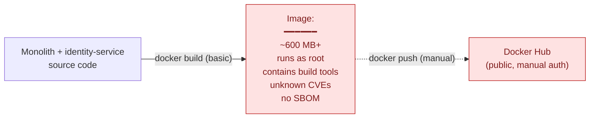
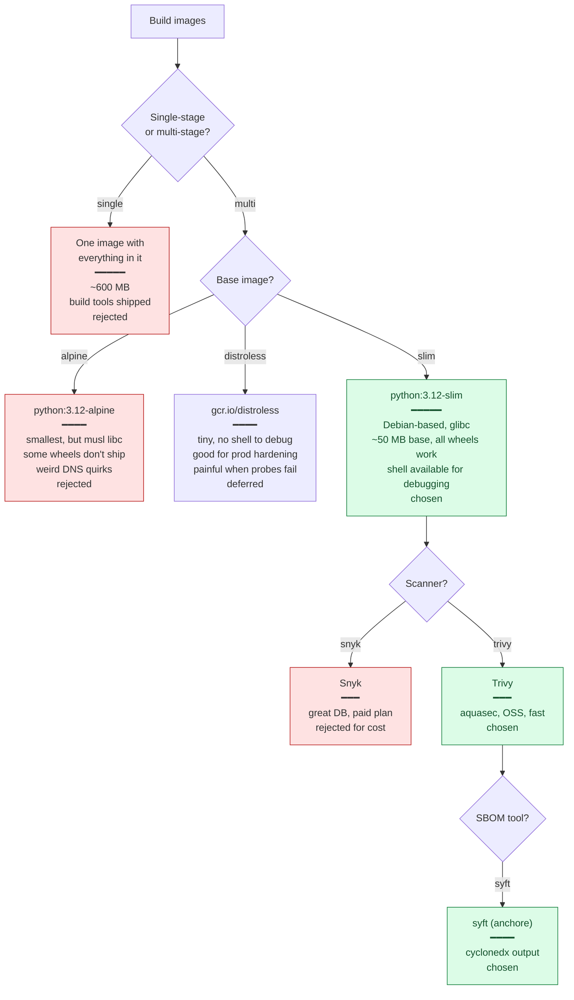
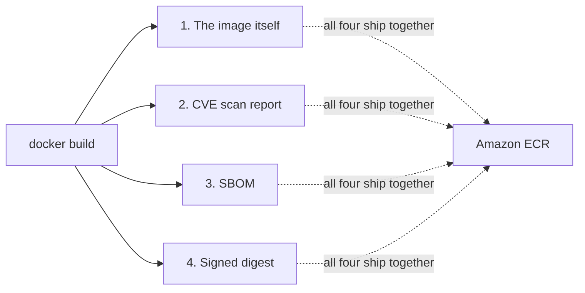

# Phase 2 Concept Brief — Containers & Supply Chain

> **Read this if you want to defend every line of your `Dockerfile` and every step of your image build pipeline.**
> Time: ~15 min.
> **Goal:** every image that runs in production is small, runs as non-root, is scanned for known CVEs, has a Software Bill of Materials (SBOM) attached, and lives in a registry you control.

---

## Where Phase 1 left us



This is what a typical "I have a Dockerfile" looks like. Every problem with it is interview gold for the wrong reason:

- **Image size** — a 600 MB image takes ~30s to pull on a fresh node. K8s does this every time a pod relocates. Multiply by 10 services × 100 deploys/day → real money.
- **Root user** — a container escape on a root-process container is a host compromise. Standard CIS benchmark violation.
- **Build tools inside** — `gcc`, `make`, `apt` cached lists are all attack surface that adds nothing at runtime.
- **No CVE scan** — you ship a known-broken `openssl` to prod and find out from the customer.
- **No SBOM** — six months later log4j happens again. You can't answer *"are we affected?"* without rebuilding to inspect.
- **Docker Hub** — public registry, rate-limited, anyone with the URL can pull. Not where production images live.

Phase 2 fixes every one of these.

---

## The decision tree



---

## What "supply chain security" actually means

Four artefacts come out of a hardened image build. If any of them is missing, the supply-chain story isn't real.



### 1. The image — multi-stage, slim, non-root

```dockerfile
# Stage 1: builder — has pip and source, produces the venv
FROM python:3.12-slim AS builder
RUN python -m venv /opt/venv
ENV PATH="/opt/venv/bin:$PATH"
WORKDIR /app
COPY requirements.txt .
RUN pip install --no-cache-dir -r requirements.txt

# Stage 2: runtime — only the venv and the app code
FROM python:3.12-slim AS runtime
RUN useradd --create-home --uid 1000 appuser
WORKDIR /app
COPY --from=builder /opt/venv /opt/venv
COPY . .
USER appuser
CMD ["uvicorn", "app.main:app", "--host", "0.0.0.0", "--port", "8000"]
```

The key moves:

- **Two `FROM` lines** — the builder has pip + build tools, the runtime has only the resolved venv. Final image is ~150 MB instead of ~600 MB.
- **`--no-cache-dir`** — pip's wheel cache adds 50+ MB you never use again.
- **`useradd --uid 1000 appuser` + `USER appuser`** — every CIS benchmark wants this. Container escape attacks need root *inside* the container to chain into a host escape; non-root closes that path.
- **No `RUN apt-get install …` in runtime** — every package is a CVE surface.

The frontend Dockerfile is the same shape but ends in `nginx:alpine` serving the built React bundle. Final frontend image: ~25 MB.

### 2. CVE scan with Trivy

Trivy reads the image layers, cross-references every installed package against the National Vulnerability Database, and exits non-zero on findings above your threshold.

```bash
docker run --rm \
  -v /var/run/docker.sock:/var/run/docker.sock \
  aquasec/trivy image --exit-code 1 \
  --severity HIGH,CRITICAL --ignore-unfixed \
  shopforge-backend:ci
```

- **`--severity HIGH,CRITICAL`** — don't fail the build on LOW/MEDIUM that nobody has time to fix.
- **`--ignore-unfixed`** — if upstream has no patch available, blocking the build accomplishes nothing.
- **`--exit-code 1`** — turns the scan into a *gate*, not a report.

This runs inside the CD workflow (Phase 3). One failing build means one image that never reaches ECR.

### 3. SBOM with syft

A Software Bill of Materials is a structured manifest of every package, version, and license in the image. Format: **CycloneDX JSON** (industry standard, ingestible by SBOM tools).

```bash
docker run --rm \
  -v /var/run/docker.sock:/var/run/docker.sock \
  anchore/syft shopforge-backend:ci \
  -o cyclonedx-json > sbom-backend.cdx.json
```

Why this matters in real life: when the next log4shell-class CVE breaks at 2 AM, you don't have to rebuild ten images to ask *"is `log4j-core` in there?"*. You `grep` ten SBOMs. The answer is in seconds.

The SBOM is uploaded as a GitHub Actions artifact in `cd.yml` so it's queryable per commit.

### 4. ECR — your own registry

Amazon ECR replaces Docker Hub for three reasons:

- **Private by default** — only IAM-authenticated callers pull.
- **Immutable tags** (lifecycle policy enforced) — once `:abc123` is pushed, nobody can re-push the tag to a different image. Critical for reproducible deploys.
- **Image scanning hook** — ECR can re-scan stored images against fresh CVE data; you don't have to rebuild to find out a CVE was disclosed yesterday.

Lifecycle policy (`infra/ecr-lifecycle.json`) keeps only the latest 20 tags per repo so the registry doesn't grow forever.

---

## What we actually built

```
backend/Dockerfile                 # multi-stage slim, non-root, healthcheck
frontend/Dockerfile                # multi-stage: node:20-alpine → nginx:alpine
services/identity-service/Dockerfile
infra/ecr-lifecycle.json           # keep last 20 tags
sbom/                              # committed example SBOMs for reference
```

The CD workflow (Phase 3) ties them together: every push to `main` builds → Trivy scans → syft generates SBOM → docker push to ECR with `:${commit-sha}` immutable tag.

---

## What we did *not* do, and why

| Cut | Why |
|-----|-----|
| Distroless base image | Distroless has no shell. When a readiness probe fails and you need to `kubectl exec -it … sh` to debug, you're stuck. Worth it in real prod; not worth it for a learning portfolio. |
| Image signing with cosign | Saved for Phase 3. CI/CD is the right home for signing — keys are short-lived and tied to the workflow identity. |
| Admission controller enforcing signed images | Phase 5+ would add Kyverno or Sigstore policy. Portfolio doesn't need the extra moving piece. |
| `docker scout` / Snyk | Paid SaaS, OSS Trivy does the same job for portfolio scope. |
| SBOM signing / attestation | Possible with cosign attest, but adds a layer that nobody reviews at this scale. |
| Image-rebuild on CVE disclosure | Would need a cron + Renovate. Real-prod yes, portfolio no. |

---

## Interview talking points

> **Q: "What's in your production image that you'd want to remove?"**
>
> "Honestly very little. The Python slim base is ~50 MB, the venv is ~80 MB, the app code is ~5 MB. There's no `apt` cache, no pip cache, no source compilers. The next step would be distroless to remove the shell, but I want to keep debugging ergonomics for a portfolio."

> **Q: "Why Trivy?"**
>
> "OSS, fast, the CVE database is curated by aquasec and is one of the better ones outside the paid tools. It also reads CycloneDX SBOMs directly, which means the same tool can scan and reuse the SBOM we already generate."

> **Q: "What does an SBOM let you do that scanning doesn't?"**
>
> "Scanning answers *'is there a known CVE in this image right now?'*. The SBOM answers *'six months from now, when a new CVE is disclosed for log4j-core 2.14, was that version ever in any image I shipped?'*. It's a different question — point-in-time vs. historical. You need both."

> **Q: "How do you prevent someone from re-pushing the same tag?"**
>
> "ECR has tag immutability turned on at the repository level. Once `shopforge-backend:abc123` exists, the push API rejects another push at the same tag. The only way to change what `:abc123` points to is to delete and re-create the repo — which is a deliberate-and-loud act, not an accident."

> **Q: "Your image runs as UID 1000. What does that actually buy you?"**
>
> "It breaks the container-escape → host-escape chain. Most published k8s escape chains start with *'attacker has root inside the container'*. If the process is UID 1000 and the container filesystem is owned by UID 1000, the next link in the chain — abusing a privileged syscall or mounting a host path — needs UID 0 and fails. It's not bulletproof but it's free and it kills the easiest class of escape."

---

## When you actually understand Phase 2

You can answer this without thinking:

> *"The Trivy scan in CI passed yesterday and fails today. The image hasn't changed. What happened?"*

The CVE database was updated. A new disclosure landed against a package already in the image. The job to do is **not** to ignore the scan — it's to (a) check if a fixed version is available upstream, (b) bump the dependency or the base image, (c) re-build, (d) confirm the scan now passes. If no fix is available, document the temporary exception and the date you'll re-check. *Recognising that the scan failure is real signal, not a flaky test, is the interview answer.*
