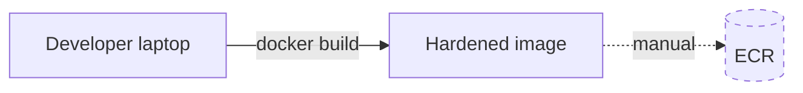
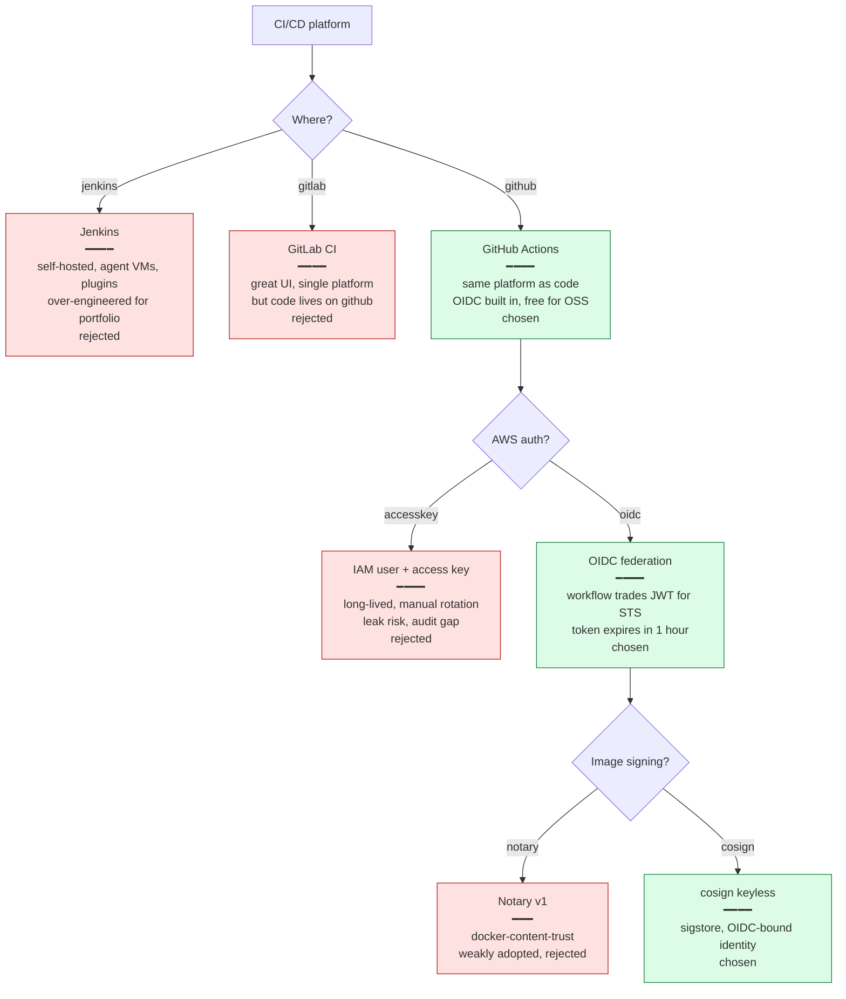
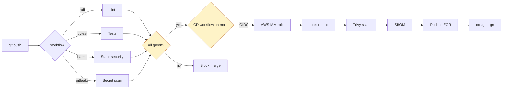
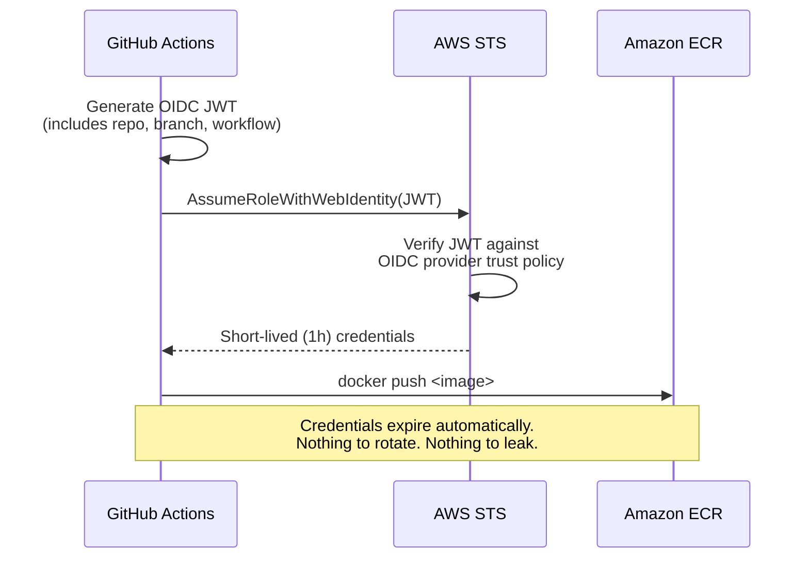

# Phase 3 Concept Brief — DevSecOps CI/CD

> **Read this if you want to explain how a commit becomes a signed, scanned, deployed artefact without any long-lived AWS keys.**
> Time: ~15 min.
> **Goal:** every push to `main` automatically lints, tests, scans, signs, and ships images to ECR — using a short-lived OIDC token, never a static IAM access key.

---

## Where Phase 2 left us



The image is good but the *path* from commit to ECR is a person typing `docker push` after putting an IAM access key in their shell. Three problems:

1. **Inconsistent** — every dev has different local Docker, different Trivy version, different SBOM-generator behaviour. No two builds are bit-identical.
2. **Long-lived secrets** — AWS access keys sitting in `~/.aws/credentials` and in any number of CI secrets. Standard interview question: *"how do you rotate?"* and the honest answer is *"I don't, until something leaks."*
3. **No audit trail** — when an image lands in ECR, you can't prove *which commit* produced it or *who* triggered the build.

Phase 3 makes every push automatic, identity-bound, and signed.

---

## The decision tree



---

## What "DevSecOps CI/CD" actually means



### CI — `.github/workflows/ci.yml`

Three parallel jobs gate every PR:

| Job | Tool | What it catches |
|-----|------|-----------------|
| Backend | `ruff` + `bandit` + `pytest` | Code style, common security anti-patterns, broken behaviour |
| Frontend | `npm run build` (vite + tsc) | Type errors, build failures |
| Secret scan | `gitleaks/gitleaks-action@v2` | An AWS key, GitHub token, or RSA private key accidentally committed |

The point of *security inside CI* (DevSecOps) is that **the gate is the same gate that runs the tests** — you can't merge a PR that introduces a known security smell. No separate security team, no separate workflow, no separate UI to check.

### CD — `.github/workflows/cd.yml`

Only runs on `push: branches: [main]`. The OIDC dance is where the magic happens:

```yaml
permissions:
  id-token: write       # required to mint the OIDC JWT
  contents: read

steps:
  - name: Configure AWS credentials (OIDC)
    uses: aws-actions/configure-aws-credentials@v4
    with:
      role-to-assume: arn:aws:iam::563332534764:role/github-actions-ecr-push
      aws-region: ap-south-1
```

**What's happening under the hood:**



The IAM role's *trust policy* says: *"trust the GitHub OIDC issuer, and only when the JWT claims `repo:ganesha2208/three-tier-ecom` and `ref:refs/heads/main`"*. Other repos, other branches, other workflows — all rejected by STS at the federation layer. **No secret to leak because there is no secret.**

### Image signing — keyless cosign

After ECR push, cosign signs the image:

```bash
cosign sign --yes $REGISTRY/shopforge-backend:$COMMIT_SHA
```

"Keyless" means the signing key is **derived from the OIDC token of the current workflow** — there's no `cosign.key` file anywhere. The signature is stored in a public transparency log (Rekor). Anyone can later verify *who* signed it (`cosign verify` against the same OIDC identity), and the answer is *"this image was signed by the github-actions workflow in the three-tier-ecom repo's main branch on date X"*. Provenance baked into the system.

---

## What we actually built

```
.github/workflows/
├── ci.yml              # backend lint+tests+security, frontend build, secret scan
├── cd.yml              # OIDC → build → Trivy → SBOM → push → cosign sign
└── docs.yml            # build mkdocs site, deploy to GitHub Pages
```

Plus, in Terraform (Phase 4):

```hcl
# An IAM role that GitHub Actions can assume via OIDC
resource "aws_iam_role" "github_actions_ecr_push" {
  assume_role_policy = data.aws_iam_policy_document.gh_oidc.json
}

# The trust policy — only this repo, only this branch, only this workflow
data "aws_iam_policy_document" "gh_oidc" {
  statement {
    principals { type = "Federated"; identifiers = [aws_iam_openid_connect_provider.github.arn] }
    actions    = ["sts:AssumeRoleWithWebIdentity"]
    condition {
      test     = "StringEquals"
      variable = "token.actions.githubusercontent.com:sub"
      values   = ["repo:ganesha2208/three-tier-ecom:ref:refs/heads/main"]
    }
  }
}
```

---

## What we did *not* do, and why

| Cut | Why |
|-----|-----|
| Dependabot / Renovate auto-PRs | Worth turning on; the portfolio just doesn't depend on it. Easy follow-up. |
| Canary or blue/green deploys | Would need an Argo Rollouts CRD on top of vanilla Deployments. Phase 5's plain HPA + rolling-update covers the basics. |
| Image promotion (dev → stage → prod) | One environment. Adding promotion adds two more clusters and three Argo CD apps. Not portfolio-scoped. |
| Self-hosted runners | GitHub-hosted is free and avoids one more thing to babysit. |
| Conftest / OPA policies in CI | Worth adding for k8s manifest validation; deferred. |
| Required signed-commit verification | The workflow itself ensures provenance; commit signing duplicates that. |

---

## Interview talking points

> **Q: "How are your AWS credentials handled in CI?"**
>
> "They're not. There are no AWS credentials in the workflow. GitHub Actions mints an OIDC JWT that encodes the repo, branch, and workflow identity. The IAM role's trust policy only accepts JWTs from this specific repo and branch. STS exchanges the JWT for credentials that expire in an hour. Nothing to rotate, nothing to leak."

> **Q: "What does cosign keyless give you that signing with a static key wouldn't?"**
>
> "The identity is the signer. With a static key, the question *'who signed this?'* answers *'whoever has the key'* — and keys leak. With keyless, the signature is bound to the OIDC identity of the workflow at sign time: `github-actions / ganesha2208/three-tier-ecom / main`. You can prove provenance, and you can't accidentally share the signing capability by leaking a file."

> **Q: "What happens if Trivy finds a HIGH-severity CVE in the image during CD?"**
>
> "The workflow fails with exit code 1, and no image is pushed to ECR. The fix path is documented: bump the offending dependency, push a new commit, the next CD run scans clean. The build *is* the gate."

> **Q: "How does the workflow know to only run on the main branch?"**
>
> "Two layers. The workflow's `on:` clause filters to `push: branches: [main]` so it only triggers there. But more importantly, even if someone manually triggered it from a different branch, the OIDC sub claim wouldn't match the trust policy's `ref:refs/heads/main` condition, and STS would reject the federation. Defense in depth — workflow filter for ergonomics, trust policy for security."

> **Q: "What's the difference between CI and CD in your setup?"**
>
> "CI runs on every push and pull request. It's the safety net — lint, tests, security scan, secret scan. It says *'this code is shippable'*. CD only runs on merges to main. It's the actual ship — build, scan the image, generate the SBOM, push to ECR, sign. CI gates merging; CD ships the result."

---

## When you actually understand Phase 3

You can answer this without thinking:

> *"A developer's GitHub PAT leaks. What's the blast radius on your AWS account?"*

Zero (for this workflow). Their PAT can read/write to GitHub repos they have access to, including pushing to branches they own. But the OIDC trust relationship requires the GitHub Actions OIDC issuer — not a human-controlled PAT. A human can't impersonate a workflow run to STS. The IAM role can only be assumed from inside a running workflow.

That's the *whole point* of OIDC federation: a leaked human credential can't reach AWS because AWS doesn't trust humans through this path — it trusts the workflow runtime, and only when the JWT claims match the trust policy.
