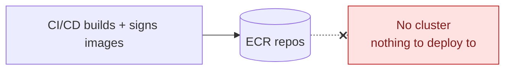
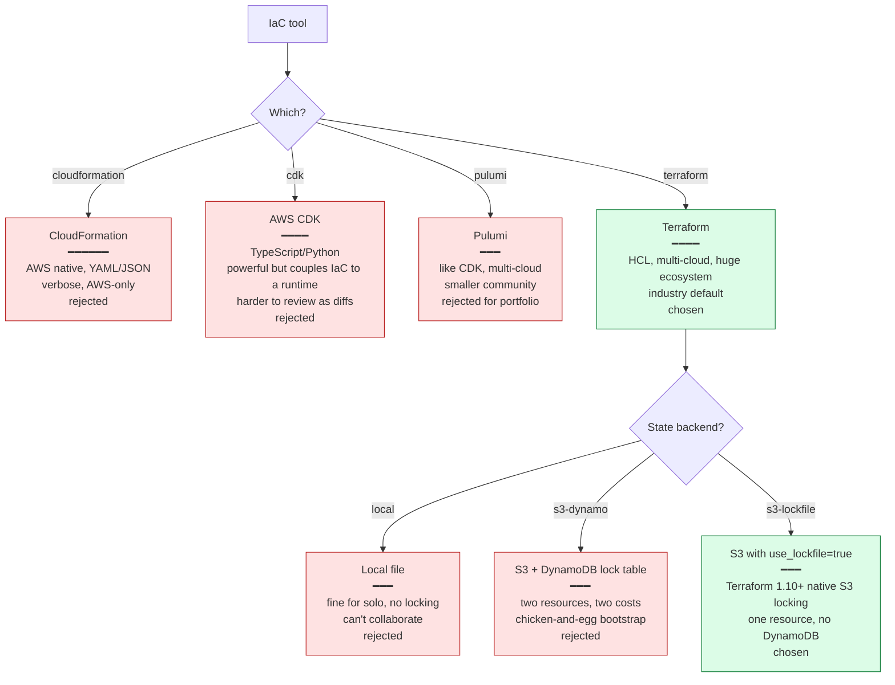
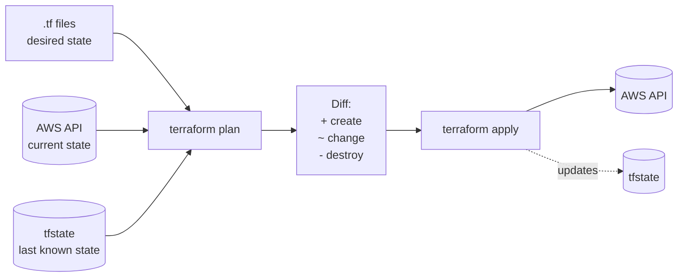
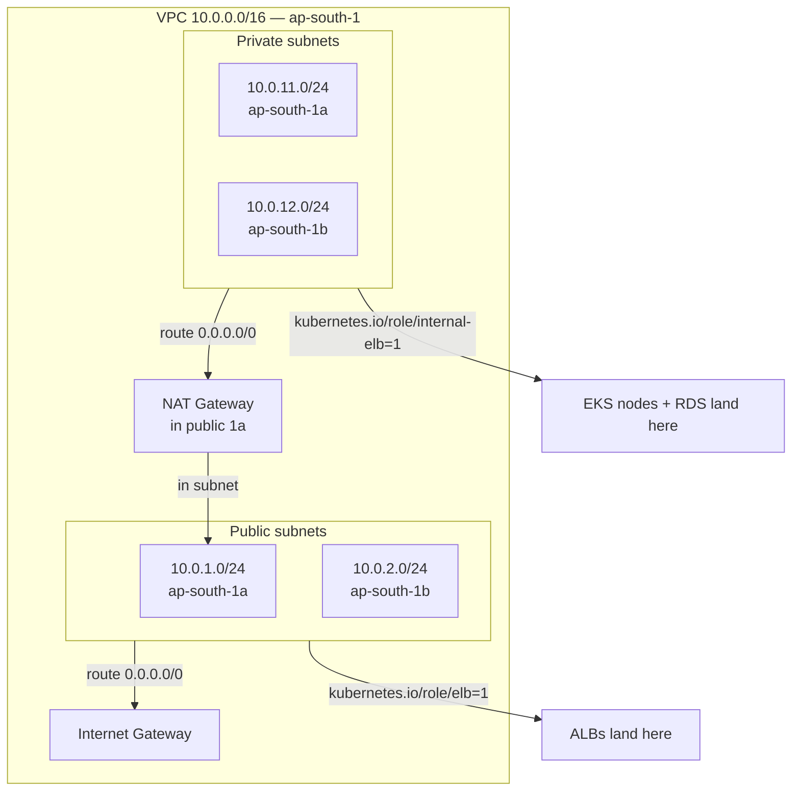
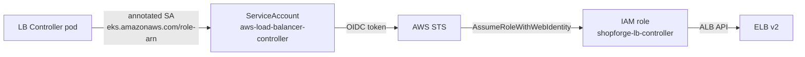

# Phase 4 Concept Brief — Terraform Infra

> **Read this if you want to explain why one `terraform apply` produces a working production-style cloud, and why the state file is the most important file in the repo.**
> Time: ~20 min.
> **Goal:** every AWS resource — VPC, subnets, NAT, EKS, RDS, ECR, IAM roles, IRSA — is declared as code, applied from a single command, and torn down just as cleanly.

---

## Where Phase 3 left us



Signed images sit in ECR. Nothing to run them. Phase 4's job is to bring up the cloud: networking, compute, data, and the IAM that ties them together.

The cardinal sin to avoid: **click-ops**. Clicking through the AWS console to create a VPC and an EKS cluster takes 20 minutes and is unreviewable, unrepeatable, and undocumented. Every recruiter has seen "I built a cluster" portfolios that can't reproduce themselves.

---

## The decision tree



---

## What "Terraform" actually is

Terraform reads `.tf` files (HCL — HashiCorp Configuration Language), figures out the **desired state** of your cloud, compares it against the **current state** (stored in `terraform.tfstate`), and computes a plan to make them match.



The state file is **the source of truth Terraform consults to compute diffs**. If it's lost, Terraform thinks all resources are new and tries to create duplicates. If it's wrong, Terraform plans destructive changes. Treat it like the production database — backed up, locked when in use, encrypted at rest.

### S3 backend with native locking (Terraform 1.10+)

```hcl
terraform {
  required_version = ">= 1.10"

  backend "s3" {
    bucket       = "shopforge-tfstate-563332534764"
    key          = "phase4/terraform.tfstate"
    region       = "ap-south-1"
    encrypt      = true
    use_lockfile = true       # the new bit — no DynamoDB needed
  }
}
```

Before TF 1.10, you needed a DynamoDB table just to hold a lock entry while `apply` ran. Now S3 has conditional-write semantics that Terraform exploits to do the same thing in one bucket. **One less resource to bootstrap, one less bill line, same correctness guarantees.**

---

## What we actually built

```
infra/terraform/
├── versions.tf         # required_version, providers, S3 backend
├── providers.tf        # aws provider config + region + default tags
├── variables.tf        # project name, region, az count, instance sizes
├── vpc.tf              # uses terraform-aws-modules/vpc — VPC + IGW + NAT + subnets
├── eks.tf              # uses terraform-aws-modules/eks — cluster + node group + KMS
├── eks-addons.tf       # the AWS LB Controller IRSA role
├── rds.tf              # subnet group + SG + db.t3.micro Postgres
└── outputs.tf          # cluster name, RDS endpoint, role ARNs (consumed by bootstrap.sh)
```

### The network layer (`vpc.tf`)



Key choices:

- **Two AZs** (1a, 1b) — minimum for an EKS cluster, RDS-compatible, no extra cost vs three.
- **Single NAT Gateway** — costs ~$0.045/hr. Two NATs (one per AZ) would double that. Tradeoff: if 1a goes down, pods in 1b lose egress to the internet. Documented in `dr-runbook.md` as a known portfolio cut.
- **Subnet tags** (`kubernetes.io/role/elb=1`, `internal-elb=1`) — the AWS LB Controller scans these tags to decide where to put ALBs. Without them, ingress provisioning silently fails.

### The cluster (`eks.tf`)

Uses the `terraform-aws-modules/eks/aws` module — 800+ lines of best-practice IAM and security group rules you don't write yourself. We just pass:

```hcl
cluster_name    = "shopforge-eks"
cluster_version = "1.32"
vpc_id          = module.vpc.vpc_id
subnet_ids      = module.vpc.private_subnets

eks_managed_node_groups = {
  default = {
    instance_types = ["m7i-flex.large"]
    min_size = 1; desired_size = 2; max_size = 3
  }
}

cluster_encryption_config = { … }   # KMS-encrypted etcd secrets
enabled_cluster_log_types = ["api","audit","authenticator"]
```

- **m7i-flex.large** — Intel 2 vCPU / 8 GB, *flex* burst pricing. Same baseline performance as a fixed node but cheaper when idle. For a portfolio that scales 0→100 VUs for 8 minutes, flex is the right shape.
- **KMS-encrypted etcd** — every secret stored in the cluster (including `shopforge-secrets`) is encrypted with a customer-managed key. CIS requirement, free.
- **API + audit logs** — sent to CloudWatch. When you need to know who deleted what, this is the only place to find out.

### RDS (`rds.tf`)

```hcl
resource "aws_db_instance" "main" {
  identifier              = "shopforge-db"
  engine                  = "postgres"
  engine_version          = "16"
  instance_class          = "db.t3.micro"
  allocated_storage       = 20
  storage_encrypted       = true
  multi_az                = false        # portfolio cut
  backup_retention_period = 0            # portfolio cut
  skip_final_snapshot     = true         # portfolio cut
  manage_master_user_password = true     # AWS Secrets Manager holds the password
}
```

The three "portfolio cuts" are explicit and documented in the DR runbook. In production, those flip to `multi_az=true`, `backup_retention=7`, `skip_final_snapshot=false`. The lines are right there, ready to be flipped.

### IRSA — the IAM-to-service-account bridge

The AWS LB Controller pod needs IAM permissions to create ALBs. Two ways to do this:

1. **Node IAM role** — attach a policy to the node's IAM role. **Bad:** every pod on every node gets those permissions.
2. **IRSA (IAM Roles for Service Accounts)** — only pods bound to a specific Kubernetes service account get the role. Achieved via EKS's OIDC provider.



Same OIDC federation trick as Phase 3, but the identity is *the Kubernetes service account*, not GitHub. Recurring pattern — wherever AWS gives short-lived credentials to a workload, OIDC federation is the answer.

---

## What we did *not* do, and why

| Cut | Why |
|-----|-----|
| Multi-AZ NAT | ~$50/month for the second NAT. Portfolio cluster runs for hours, not months. |
| Multi-AZ RDS | Same — Multi-AZ doubles the RDS cost and the storage. |
| Backups + final snapshot | Same — backup storage costs accumulate even when the DB is destroyed. |
| Three or more AZs | EKS minimum is two; the third buys availability we're not measuring. |
| `terraform workspace` per env | One env (prod-shaped portfolio). Workspaces add complexity without benefit at scope. |
| Atlantis or Spacelift for PR-driven plans | Worth it in a team setting; solo + portfolio = `apply` locally, lock via S3. |

---

## Interview talking points

> **Q: "Why Terraform over CDK?"**
>
> "CDK turns infra into code-you-execute. Terraform is code-you-declare. Reviews of a Terraform plan are mechanical — you read a textual diff of resources. Reviews of CDK output mean understanding the synth step. For a portfolio where one of the goals is *interview-defensible reviews*, the declarative diff wins. CDK is excellent for product teams that want to share TypeScript types between app and infra."

> **Q: "Where does your state live and what protects it?"**
>
> "S3 bucket `shopforge-tfstate-<account-id>`, key `phase4/terraform.tfstate`. Versioned, server-side encrypted, no public access. Locking is native S3 conditional-write — Terraform 1.10's `use_lockfile=true` replaces the old S3+DynamoDB pattern with one resource. If two people try `apply` at the same time, the second one fails fast."

> **Q: "What's IRSA and why is it better than node IAM roles?"**
>
> "IAM Roles for Service Accounts. Instead of giving the node permission to do AWS things and hoping that any pod on the node is well-behaved, you bind the role to a Kubernetes service account via the cluster's OIDC provider. Only pods using that service account get the role. It's least-privilege at the pod level instead of the node level."

> **Q: "What happens when you run `terraform apply` from a fresh laptop?"**
>
> "It reads `versions.tf`, finds the S3 backend config, initializes (downloads providers, sets up state reference), takes the lock on the state file, computes the diff from current state, prints the plan. With `-out=file.tfplan`, the plan is frozen; `terraform apply file.tfplan` executes that exact plan, no surprises in between. State is updated, lock is released."

> **Q: "Your RDS has `skip_final_snapshot=true` and `backup_retention=0`. Why?"**
>
> "Cost. This is a portfolio that's spun up for demos and torn down. With backups on, every destroy leaves snapshots that keep billing. With final snapshot on, every destroy is interactive. Both flags are right there in the .tf, with comments — flipping them to production-safe values is one PR. I documented this in the DR runbook so it doesn't read as a mistake."

---

## When you actually understand Phase 4

You can answer this without thinking:

> *"Someone manually deleted a security group in the AWS console. What does the next `terraform plan` say, and what's the right reaction?"*

The plan will show that the SG needs to be **created** — Terraform sees its desired state (the resource is in the .tf) and the current state (the resource is gone from AWS) and computes the diff. The right reaction is *not* to delete the .tf to match reality — that's the wrong direction. The right reaction is to investigate why a human modified prod infra, then run `apply` to restore the declared state. *That's the whole point of declarative IaC: the .tf is the contract, the cloud is the execution; when they diverge, the .tf wins.*
