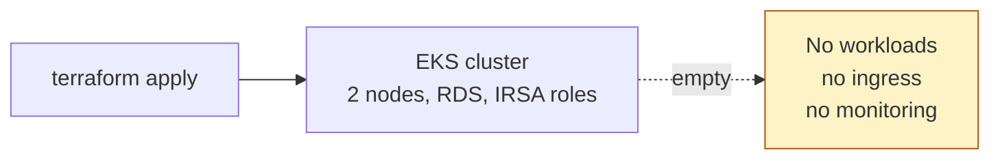
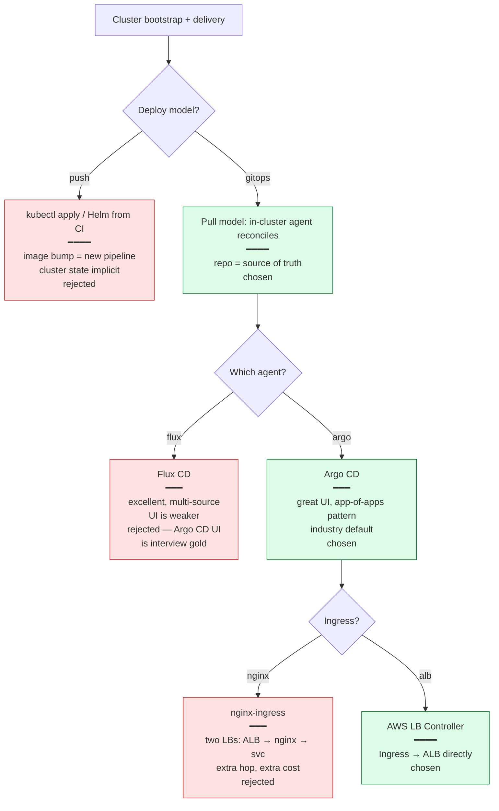
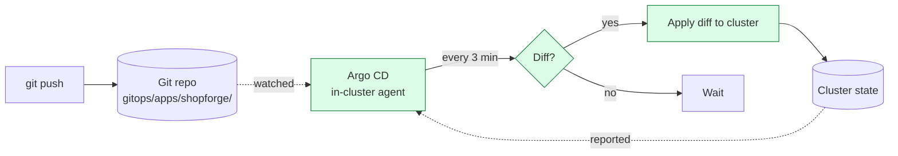
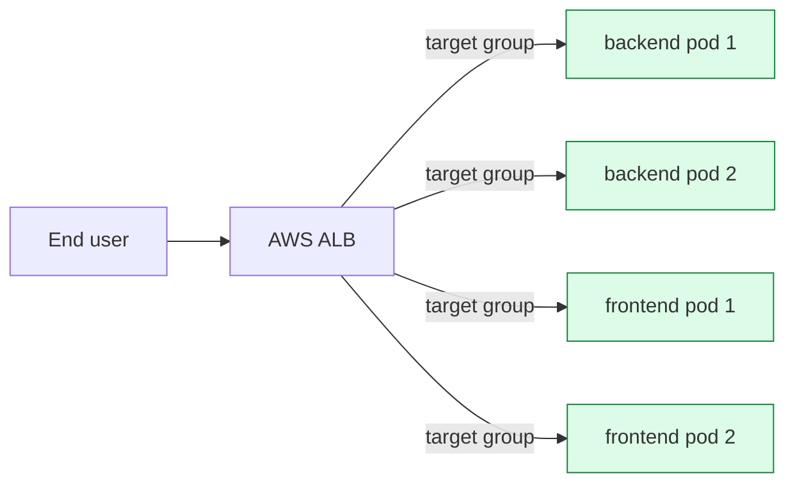

# Phase 5 Concept Brief — EKS + GitOps

> **Read this if you want to defend the deployment model: a merged Git commit is the deploy, not `kubectl apply` on someone's laptop.**
> Time: ~20 min.
> **Goal:** the cluster's state is a *function of the git repo*. Argo CD continuously reconciles the gitops directory into the cluster. The ALB is born from an Ingress object, not the console.

---

## Where Phase 4 left us



The cluster exists. It has zero workloads. The next move could be `kubectl apply -f manifest.yaml` from a laptop — and it would *work*, but it would also be every problem GitOps was invented to solve:

- **No source of truth** — what's actually deployed? Whatever was last applied. By whom? Whoever has kubeconfig.
- **Drift goes silent** — someone edits a Deployment with `kubectl edit`. The git repo is now wrong. Next deploy from git silently overwrites the manual fix. Or the manual fix silently masks a bug in the manifest. Either way, debugging is nightmare.
- **No rollback story** — what was running before the bad deploy? You hope someone screenshotted `kubectl get all -o yaml`.

Phase 5's job is to make the cluster reflect the git repo, continuously, without humans in the path.

---

## The decision tree



---

## What "GitOps" actually is

A single sentence definition:

> *Cluster state is defined by what's in git; an in-cluster agent continuously makes the cluster match.*



Three properties fall out for free:

1. **Audit** — `git log` is the deploy history. Every change to the cluster has an author, timestamp, message, and revert button.
2. **Drift detection** — if someone `kubectl edit`s a Deployment, Argo CD sees the diff and (configurable) either alerts you or overwrites the change. Auto-heal is a single flag.
3. **Rollback** — `git revert` is the rollback. No special tooling.

### The bootstrap chicken-and-egg

GitOps means an in-cluster agent reads the git repo. But the agent itself isn't in the cluster yet, so it has to be installed *somehow*. That's the bootstrap — one imperative step at the very start.

`gitops/bootstrap.sh` is that one step:

1. Read Terraform outputs (cluster name, IAM role ARNs, RDS endpoint).
2. `aws eks update-kubeconfig` — wire `kubectl` to the new cluster.
3. Install `metrics-server` (HPA needs it).
4. Install AWS LB Controller via Helm (turns Ingress objects into ALBs).
5. Install Argo CD (server-side apply of upstream manifest).
6. Create the `shopforge` namespace + DB credentials secret.
7. Apply the **one** `Application` manifest that points Argo CD at `gitops/apps/shopforge/`.

From step 7 onward, the cluster is a function of git. The bootstrap is run **once per cluster lifetime** and never again.

---

## What we actually built

```
gitops/
├── bootstrap.sh                          # the one imperative step
├── platform/
│   └── argocd-application.yaml           # the root Application — points Argo at gitops/apps/shopforge
└── apps/
    └── shopforge/
        ├── configmap.yaml                # non-secret config (DB host, log level)
        ├── db-migrate-job.yaml           # alembic upgrade runs once per deploy
        ├── backend-deployment.yaml       # 2 replicas, non-root, resources, probes
        ├── backend-service.yaml
        ├── frontend-deployment.yaml
        ├── frontend-service.yaml
        ├── ingress.yaml                  # LB Controller creates an ALB from this
        └── hpa.yaml                      # backend + frontend HPAs
```

### The root Application (`argocd-application.yaml`)

```yaml
apiVersion: argoproj.io/v1alpha1
kind: Application
metadata:
  name: shopforge
  namespace: argocd
  finalizers:
    - resources-finalizer.argocd.argoproj.io
spec:
  source:
    repoURL: https://github.com/ganesha2208/three-tier-ecom.git
    targetRevision: main
    path: gitops/apps/shopforge
  destination:
    server: https://kubernetes.default.svc
    namespace: shopforge
  syncPolicy:
    automated:
      prune: true       # delete cluster resources removed from git
      selfHeal: true    # revert manual changes
    syncOptions:
      - CreateNamespace=true
```

Three flags carry the whole behaviour:

- **`prune: true`** — delete a YAML file in git → Argo deletes the resource in the cluster. Without this, deleted YAMLs leave orphans.
- **`selfHeal: true`** — `kubectl edit` of a Deployment? Argo immediately re-applies the git version. Drift simply can't persist.
- **`finalizers`** — when you `kubectl delete application shopforge`, Argo first deletes all the resources it created (in dependency order, so the Ingress goes before the Service goes before the Deployment) and *then* removes itself. **This is what cleanly tears down the ALB** — without it, `terraform destroy` would hit orphaned ENIs and hang.

### The Ingress → ALB magic (`ingress.yaml` + LB Controller)

```yaml
apiVersion: networking.k8s.io/v1
kind: Ingress
metadata:
  annotations:
    kubernetes.io/ingress.class: alb
    alb.ingress.kubernetes.io/scheme: internet-facing
    alb.ingress.kubernetes.io/target-type: ip
```

The AWS LB Controller pod watches Ingress objects. When this YAML applies, the controller:

1. Picks public subnets tagged `kubernetes.io/role/elb=1` (Phase 4's foresight).
2. Calls the AWS ELB v2 API to create a new ALB with a listener on :80.
3. Picks pods backing the referenced Services as targets (because `target-type: ip` registers pod IPs directly — no NodePort hop).
4. Updates the Ingress's `status.loadBalancer.ingress[0].hostname` with the ALB DNS.



When you delete the Ingress (via Argo CD or `kubectl`), the controller deletes the ALB, listeners, and target groups. **This is why the teardown sequence is `delete Argo CD Application → wait → terraform destroy`** — to give the LB Controller time to deprovision the ALB cleanly.

### Horizontal Pod Autoscaling (`hpa.yaml`)

```yaml
spec:
  scaleTargetRef:
    kind: Deployment
    name: backend
  minReplicas: 2
  maxReplicas: 4
  metrics:
    - type: Resource
      resource:
        name: cpu
        target:
          type: Utilization
          averageUtilization: 70
```

Three details that matter:

- **`minReplicas: 2`** — survives one pod loss without dropping requests. Below 2 and you can't claim HA.
- **`maxReplicas: 4`** — small ceiling on purpose; lets the Phase 8 load test *find* the ceiling.
- **`averageUtilization: 70`** — fire scale-up at 70% so new pods are *ready* by the time CPU hits 100%. Lower target = faster scale-up but more idle replicas.

---

## What we did *not* do, and why

| Cut | Why |
|-----|-----|
| Argo CD Image Updater | Image tag bumps are a deliberate human gate. Auto-updater is convenient but removes the review step. |
| Argo Rollouts (canary / blue-green) | Plain rolling update is sufficient for one workload at portfolio scale. Worth adding for real prod. |
| External DNS / cert-manager | The ALB DNS hostname is enough for portfolio demos. Real prod gets a custom domain + TLS termination. |
| Helm umbrella chart | Plain YAMLs in git are simpler to review for a portfolio. Helm is right when you have repeating variants across environments. |
| Service mesh (Istio / Linkerd) | At one app, the mesh buys nothing. RED metrics + HPA cover the basics. |
| PodSecurityPolicy or Kyverno | Worth adding. Pods are already non-root, drop ALL caps, no privilege escalation — enforcement is a follow-up. |

---

## Interview talking points

> **Q: "What's GitOps and why?"**
>
> "The cluster's state is defined by what's in git. An in-cluster agent — Argo CD — continuously reconciles the cluster against the repo. The two properties this gives me are audit (every change is a git commit) and drift detection (a manual edit gets reverted within 3 minutes). The deploy *is* the merge."

> **Q: "Pull vs push delivery — why is pull better?"**
>
> "Push gives the CI system credentials to the cluster, which means a CI compromise is a cluster compromise. Pull means the cluster reaches out to git; git doesn't reach into the cluster. Smaller blast radius. Also, the cluster can re-converge on its desired state without CI being healthy — pull is self-healing under CI outages."

> **Q: "What does the AWS Load Balancer Controller do?"**
>
> "Watches Ingress objects with `class: alb`. For each one, it provisions an AWS ALB and registers pod IPs as targets via the ELB v2 API. Uses IRSA — the controller pod has a service account bound to an IAM role with ELB and EC2 permissions. The ALB lifecycle is tied to the Ingress lifecycle; deleting the Ingress deletes the ALB."

> **Q: "Why does Argo CD use a finalizer on Applications?"**
>
> "When you `kubectl delete application shopforge`, the finalizer kicks in and prunes every resource the Application created — in dependency order. Critically, this deletes the Ingress, which triggers the LB Controller to deprovision the ALB. Without the finalizer, you'd `terraform destroy` and the controller wouldn't know to clean up; you'd get orphaned ENIs and a hung destroy. Learned this the hard way in Phase 7."

> **Q: "What does `selfHeal: true` do for you in practice?"**
>
> "If someone `kubectl edit deploy backend` to scale replicas, change image, or tweak resources, Argo CD detects the diff against git and reapplies the git version within ~3 minutes. Manual changes can't persist. This is great for new-team-member ergonomics — they can experiment freely knowing the cluster will heal back."

---

## When you actually understand Phase 5

You can answer this without thinking:

> *"You merged a bad image tag bump. The new pods crashloop. What's the rollback?"*

`git revert <bad-commit>` and push. Argo CD sees the new commit, applies the previous manifest (with the previous image tag), Kubernetes rolling-updates back. Time-to-recovery: ~3 min Argo sync interval + ~30s rolling update = under 4 minutes total, with a permanent audit trail of both the bad deploy and the rollback in `git log`. No special tooling, no `kubectl rollout undo`, no separate rollback procedure — just git.
