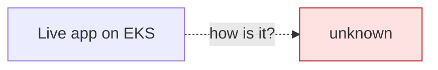
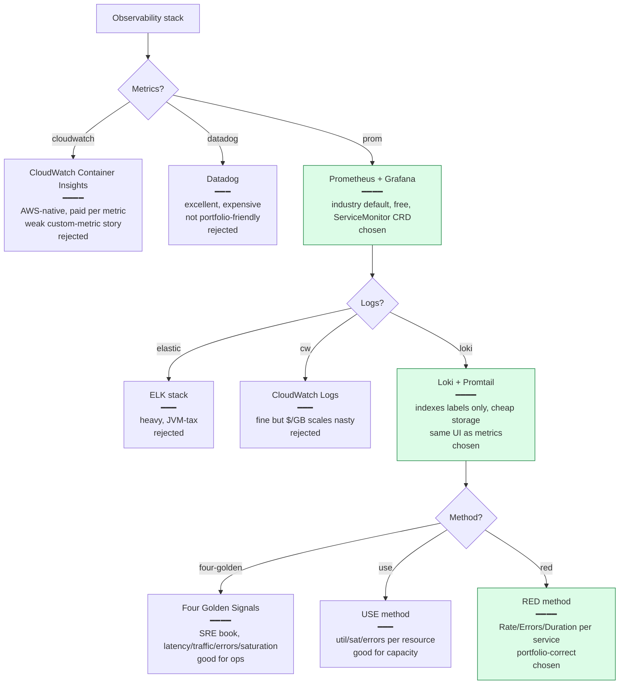
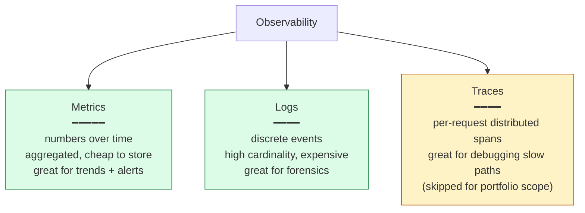
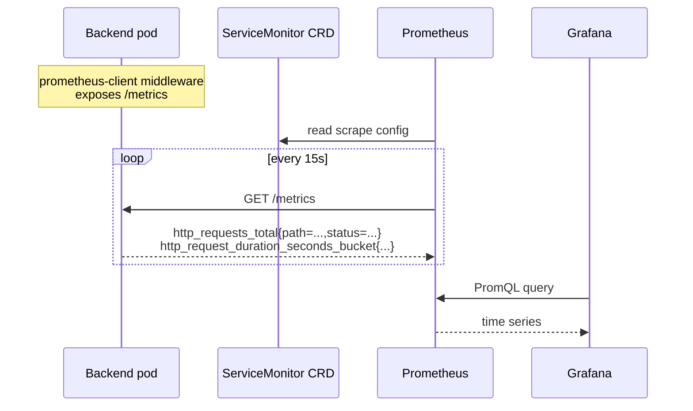
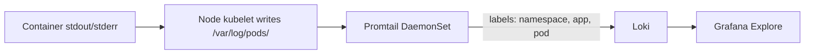

# Phase 6 Concept Brief — Observability

> **Read this if you want to defend the claim "I can see the system" — and explain what specifically you'd look at when it's slow.**
> Time: ~20 min.
> **Goal:** every backend pod is scraped for metrics, every container log is collected, and a single Grafana dashboard answers *"are users having a good time right now?"*.

---

## Where Phase 5 left us



Pods are running. Requests are flowing. We have **no idea** if:

- The error rate is 0 or 5 % (currently any user calling and complaining is the only signal).
- Latency is 30 ms or 3 s.
- Throughput is climbing or falling.
- A specific endpoint is the hot path or a forgotten one.

The cluster is a black box. Phase 6's job is to make every meaningful metric and log visible from one place.

---

## The decision tree



---

## What "observability" actually decomposes into

The Three Pillars cliché has nuance:



Metrics tell you *what* is wrong (latency spiked at 14:32). Logs tell you *why* (a specific request to `/api/v1/checkout` saw a DB connection-pool exhaustion error). Traces would tell you *which downstream call* — skipped here because at one backend, the trace is `request → handler → SQL` and the log line says the same thing.

### RED — three numbers per service

The RED method (popularised by Tom Wilkie at Weaveworks) says: for each request-serving service, show three things on the dashboard.

| Letter | Meaning | What it answers |
|--------|---------|-----------------|
| **R**ate | Requests per second | Is traffic where I expect? |
| **E**rrors | Error rate (%) | Are users hitting failures? |
| **D**uration | Latency percentiles (p50/p95/p99) | Is the experience fast? |

If those three are flat-green, the service is healthy. If any spikes, the deeper investigation starts. **No more, no less.** This is the dashboard you build first.

### How metrics actually get out



The key piece: **ServiceMonitor** is a CRD installed by the kube-prometheus-stack. It tells Prometheus which Services to scrape, on which port, with which label selectors. The application just has to expose `/metrics`; the rest is declarative.

```yaml
# observability/servicemonitor.yaml
apiVersion: monitoring.coreos.com/v1
kind: ServiceMonitor
metadata:
  name: shopforge-backend
  namespace: shopforge
spec:
  selector:
    matchLabels:
      app: backend
  endpoints:
    - port: http
      path: /metrics
      interval: 15s
```

### How logs actually get out



Loki's trick: **only the labels are indexed**, not the log content. So a query like `{namespace="shopforge", app="backend"}` is cheap, and grep-like full-text search runs across the matched stream. Compared to Elastic, Loki is ~10× cheaper to store the same volume.

---

## What we actually built

```
observability/
├── install.sh                            # idempotent installer (helm + kubectl)
├── kube-prometheus-stack-values.yaml     # Prometheus + Grafana + Alertmanager
├── loki-values.yaml                      # Loki + Promtail
├── servicemonitor.yaml                   # scrape backend
├── alerts.yaml                           # 3 ShopForge alert rules
└── dashboards/
    └── shopforge-backend.json            # the RED dashboard (committed)
```

The dashboard is **committed as JSON**. Grafana picks it up via the sidecar plugin watching ConfigMaps labelled `grafana_dashboard=1`. Three reasons this matters:

1. **Reproducible** — re-installing observability gives you the exact same dashboard.
2. **Reviewable** — dashboard changes are PRs, not "Bob edited the panel in the UI."
3. **Version-controlled** — `git blame` works on dashboards.

### Three alert rules (`alerts.yaml`)

```yaml
- alert: BackendHighErrorRate
  expr: sum(rate(http_requests_total{status=~"5..", app="backend"}[5m])) /
        sum(rate(http_requests_total{app="backend"}[5m])) > 0.05
  for: 5m
- alert: BackendHighLatencyP95
  expr: histogram_quantile(0.95, sum by (le) (rate(http_request_duration_seconds_bucket[5m]))) > 1
  for: 10m
- alert: BackendPodCrashLooping
  expr: rate(kube_pod_container_status_restarts_total{namespace="shopforge"}[15m]) > 0
```

Each rule has a `for:` — fires only after the condition holds for that duration. **Flaps are silenced by design.** A blip in latency at 14:00 shouldn't page someone if it self-recovers at 14:02.

---

## What we did *not* do, and why

| Cut | Why |
|-----|-----|
| Distributed tracing (Tempo / Jaeger) | At one backend service, the trace is the log line. Worth it across multiple services; over-engineered for portfolio. |
| Alertmanager → PagerDuty | The alerts are configured; the destination is a no-op in this scope. Wiring Slack or PagerDuty is one config change. |
| SLI / SLO dashboards | One step beyond RED. Defining error budgets requires production traffic patterns we don't have. |
| External metrics in HPA | HPA scales on CPU only. Real prod might scale on RPS via custom metrics; the prometheus-adapter would slot in. |
| Long-term storage (Thanos / Mimir) | Prometheus's local 15-day retention is plenty for portfolio. |
| Log retention policies | Loki's default is plenty for the cluster's lifetime; production needs explicit retention. |

---

## Interview talking points

> **Q: "What's on your first dashboard panel?"**
>
> "Request rate, error rate, p95 latency — the RED method. Three time-series panels in one row at the top of the backend dashboard. If those are flat-green, my service is healthy. If any spikes, that's my entry point into deeper investigation — log search by correlation ID, exemplars on the histogram, kubectl describe on pods that are misbehaving."

> **Q: "Why Loki over Elastic?"**
>
> "Loki indexes only labels, not log content. For our use case — `kubectl logs` -shaped queries by pod and namespace — that's the right tradeoff. Storage is roughly an order of magnitude cheaper than Elastic for the same log volume. Full-text search is slower, but full-text isn't the primary access pattern in container logs."

> **Q: "What's a ServiceMonitor?"**
>
> "A Custom Resource Definition installed by the kube-prometheus-stack. It tells Prometheus which Services to scrape, which port and path, and at what interval. The application doesn't know about Prometheus — it just exposes `/metrics`. The ServiceMonitor is the glue and lives in the gitops repo, so the scrape config is reviewable."

> **Q: "How do you avoid alerts flapping?"**
>
> "Every alert has a `for:` clause — the condition has to hold for N minutes before the alert fires. A brief latency spike at 14:00 that resolves at 14:02 never reaches Alertmanager. This trades a small detection delay for a huge reduction in noise."

> **Q: "Your error rate panel says 'No data'. What does that mean?"**
>
> "Either (a) there are no 5xx responses in the time window — the *Rate* function returns nothing because the matching series doesn't exist; or (b) the backend isn't being scraped at all. The way to tell them apart is to query `http_requests_total{app='backend'}` directly — if that returns data, your error metric series legitimately has zero events, and 'No data' is the *correct* visualization. If the underlying counter has no data either, scraping is broken — check the ServiceMonitor."

---

## When you actually understand Phase 6

You can answer this without thinking:

> *"p95 latency just jumped from 30 ms to 600 ms. Walk me through your investigation."*

1. **Check the error rate** — if errors are flat at 0, the service is *slow*, not *broken*. Latency-only.
2. **Look at request rate** — if it's spiking, this is a load issue. Cross-check with HPA: did replicas scale?
3. **Look at saturation** — node CPU/memory in the kube-state-metrics panel. If CPU is at 100 % per pod, the next replica didn't come up fast enough.
4. **Switch to Loki** — `{namespace="shopforge", app="backend"} |~ "slow|timeout|connection"` for the same time window. Look for DB pool exhaustion, slow query, or upstream timeouts.
5. **If RDS is involved** — RDS performance insights or `pg_stat_activity`. Likely culprits: a missing index, a write lock, a runaway transaction.

The sequence is what an interviewer wants to hear: **errors → rate → saturation → logs → upstream**. RED first, deeper second.
