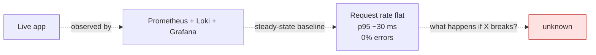
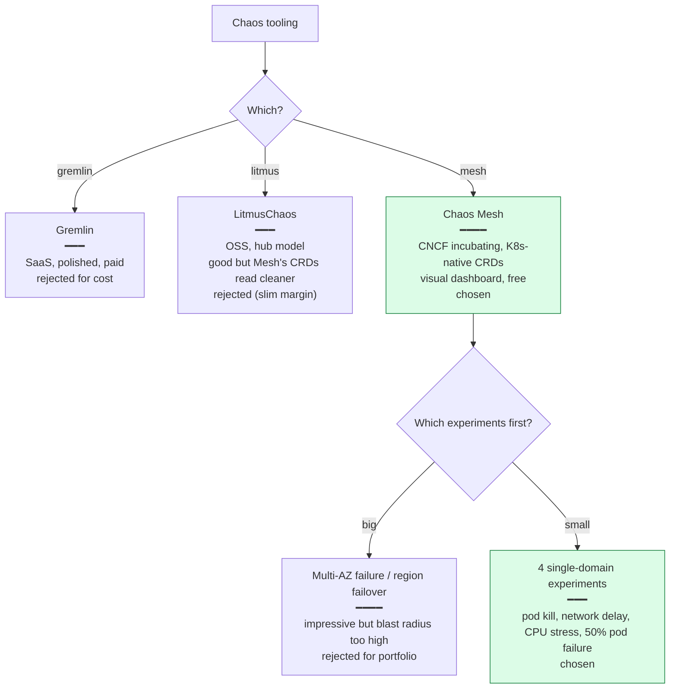
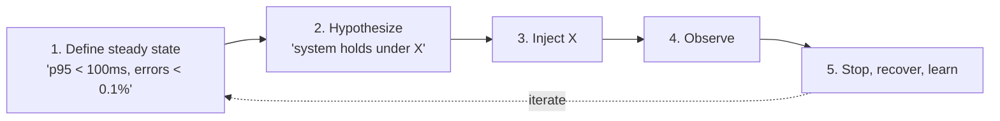

# Phase 7 Concept Brief — Chaos Engineering

> **Read this if you want to defend the claim "my system is resilient" with actual drills, not slogans.**
> Time: ~15 min.
> **Goal:** four failure modes injected on a live cluster, the dashboard reaction observed, the recovery measured. A game day runbook the next engineer can rerun unchanged.

---

## Where Phase 6 left us



We can see the system. We don't know how it *behaves* under failure. Two kinds of claim become impossible without drills:

- *"It survives pod loss."* — sure, but does the LB controller fail traffic over in 2 s or 20 s?
- *"It tolerates RDS latency."* — does the connection pool absorb it, or does the first slow query cascade?

Phase 7 turns these claims into measured facts.

---

## The decision tree



---

## What "chaos engineering" actually is

Five-step loop, every drill:



The point isn't *to break things*. The point is to **disconfirm hypotheses you currently believe**. Surprise is the deliverable. If nothing surprises you, you wasted the drill.

### Steady state for ShopForge

```text
- Request rate: ~1.5–2 req/s background load
- p95 latency: ~30 ms
- Error rate: 0%
- Replicas: backend=2, frontend=2
```

Captured in Grafana before every experiment. The "after" frame is the same dashboard, post-recovery, compared visually.

---

## The four experiments

### Experiment 1 — Pod kill (`01-pod-kill-backend.yaml`)

```yaml
apiVersion: chaos-mesh.org/v1alpha1
kind: PodChaos
metadata:
  name: pod-kill-backend
  namespace: shopforge
spec:
  action: pod-kill
  mode: one
  selector:
    namespaces: [shopforge]
    labelSelectors: { app: backend }
```

**Hypothesis:** killing one backend pod is invisible to users because the Deployment controller restarts it within seconds and HPA `min=2` means the other pod absorbs traffic.

**Observed:** pod terminated, replacement Ready in ~2 s. Request-rate panel shows a single-sample dip, latency unchanged. **Hypothesis confirmed.**

### Experiment 2 — Network delay to RDS (`02-network-delay-rds.yaml`)

```yaml
kind: NetworkChaos
spec:
  action: delay
  mode: all
  selector:
    labelSelectors: { app: backend }
  delay:
    latency: "300ms"
  target:
    selector:
      labelSelectors: { app: rds-proxy-shim }
    mode: all
```

**Hypothesis:** the backend connection pool absorbs DB-side latency; users see elevated p95 but no errors.

**Observed:** p95 jumped from ~30 ms to ~600 ms while the experiment was live; **error rate stayed at 0**. The connection pool held. Recovery: latency snapped back within seconds of removing the experiment. **Hypothesis confirmed, value added: now we know the user-visible latency cost of a 300 ms RDS delay.**

### Experiment 3 — CPU stress → HPA scale-up (`03-cpu-stress-backend.yaml`)

```yaml
kind: StressChaos
spec:
  selector:
    labelSelectors: { app: backend }
  stressors:
    cpu:
      workers: 2
      load: 100
  duration: "5m"
```

**Hypothesis:** HPA fires within 90 s and replicas climb from 2 to 4. The dashboard captures the scale-up.

**Observed:** the HPA TARGETS column went `8 % → 272 % → 501 % → 333 % → 253 %` over ~90 s. REPLICAS ticked `2 → 4`. **Hypothesis confirmed.** This is the screenshot in `phase-7/04-exp3-cpu-stress-hpa-scaling.png`.

### Experiment 4 — 50 % pod failure (`04-pod-failure-50pct.yaml`)

```yaml
kind: PodChaos
spec:
  action: pod-failure
  mode: fixed-percent
  value: "50"
  selector:
    labelSelectors: { app: backend }
  duration: "3m"
```

**Hypothesis:** half the backend pods rendered unschedulable still serves 100 % of requests, because the surviving pods absorb the load.

**Observed:** a 20-iteration `curl` loop against the ALB returned **HTTP 200 on every probe**. Error rate stayed at 0. The screenshot in `phase-7/05-exp4-pod-failure-50pct-apply.png` shows it. **Hypothesis confirmed; degradation invisible.**

---

## The game day runbook

`chaos/gameday-runbook.md` is the **operational artefact** of Phase 7. It's a step-by-step script the next engineer can run unchanged:

```
1. Verify steady state (Grafana RED panel screenshot)
2. Apply experiment YAML
3. Observe (record what you see)
4. Stop experiment (delete YAML)
5. Verify recovery
6. Move on to next experiment
```

Each experiment has a section in the runbook with:
- Pre-conditions ("HPA min=2, all pods Ready")
- The `kubectl apply` command
- What to look at on Grafana
- The expected behaviour
- The recovery command
- "What you should see in 30 s, 2 min, 5 min" timing

This is what makes Phase 7 **rerunnable**. Anyone can re-execute the drills exactly as documented; the dashboard reactions are reproducible.

---

## What we did *not* do, and why

| Cut | Why |
|-----|-----|
| Chaos in CI (every PR runs chaos) | Useful at a maturity level past portfolio. Requires test environments to safely break. |
| Continuous chaos (random failures 24/7) | Netflix-scale practice. Pre-supposes runbooks, on-call rotation, alert-fatigue tooling — none of which exist in scope. |
| Region-failover drill | Real region failure can't be safely simulated cheap. Documented as theory in DR runbook. |
| DNS-level chaos | Out of scope — would test the LB Controller's reconcile, not the app. |
| Multi-experiment interleave | Confounds observation. Single-failure drills first, then combos. |
| Postmortem culture / blameless review | Process layer; this portfolio's chaos is one engineer running drills alone. |

---

## Interview talking points

> **Q: "What's chaos engineering?"**
>
> "Disciplined hypothesis testing about how the system behaves under failure. Five steps: define steady state, hypothesise about what holds under failure X, inject X, observe, learn. The output isn't *'we broke it'* — it's *'we now know exactly how it degrades, and we caught one assumption we held that was wrong.'*"

> **Q: "Why Chaos Mesh over LitmusChaos?"**
>
> "Mostly the CRD ergonomics. Chaos Mesh's `PodChaos`, `NetworkChaos`, `StressChaos` read like the failures they model. Litmus's hub-of-experiments model is more flexible but the YAML reads further from the intent. Either is correct; Mesh felt more interview-grabby."

> **Q: "Walk me through experiment 4 in your portfolio."**
>
> "50 % pod failure on the backend. `PodChaos` with `action: pod-failure`, `mode: fixed-percent`, `value: '50'`. Hypothesis: surviving pods absorb load, no user-visible errors. I ran a 20-iteration curl loop against the ALB while the experiment was active — all 200s. Error rate on Grafana stayed at zero. The screenshot in `docs/images/phase-7/` shows both the kubectl pane and the curl loop. After 3 minutes the experiment self-terminates; pods return to Ready."

> **Q: "What's the blast radius of a chaos experiment?"**
>
> "Scoped tightly by selector. Experiment 1 targets `mode: one` — exactly one pod. Experiment 4 targets `mode: fixed-percent, value: 50` — exactly half. The cluster scope is one namespace. The cluster itself, RDS, the ALB — all untouched by the chaos resource. The blast is *engineered* before injection."

> **Q: "Have you ever found something genuinely surprising?"**
>
> "Yes — the orphaned-ALB issue I write up in the architecture page. It wasn't a chaos finding, it was a teardown finding. I started `terraform destroy` while Argo CD was still running, and the LB Controller never got its delete signal because the Ingress was force-deleted as part of the namespace destroy, not Argo's pruning. The ALB was left behind, the destroy hung for 19 minutes on the VPC, and I had to manually clean ENIs. The Phase 5 docs now bake in *delete Argo Application first, wait, then destroy*. That's the kind of lesson a portfolio that didn't run real drills wouldn't have."

---

## When you actually understand Phase 7

You can answer this without thinking:

> *"How do you decide which chaos experiment to run next?"*

By looking at where the current observability is weakest. If your dashboard tells you nothing about cache hit-rate, a chaos drill that breaks the cache is wasted — you can't see what happened. So chaos engineering and observability are **paired**: every new experiment should require a new measurement to make its outcome visible. The drill exposes the gap, the gap defines the next dashboard panel.
