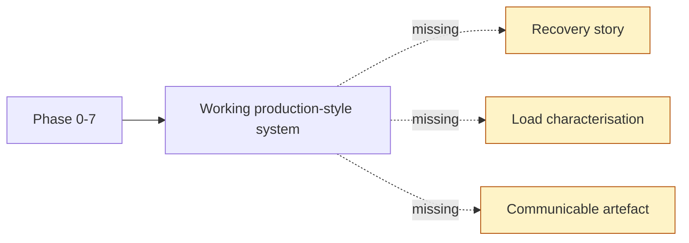
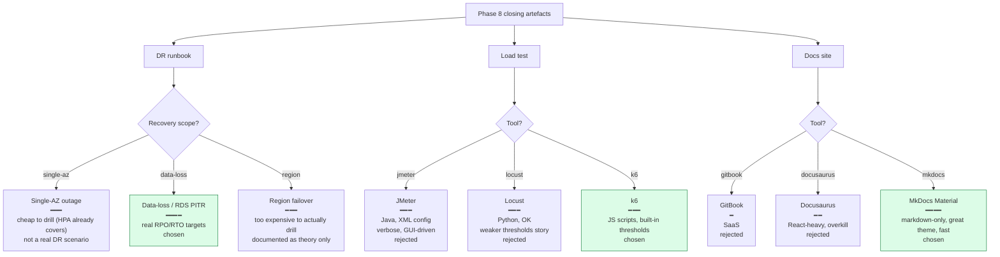
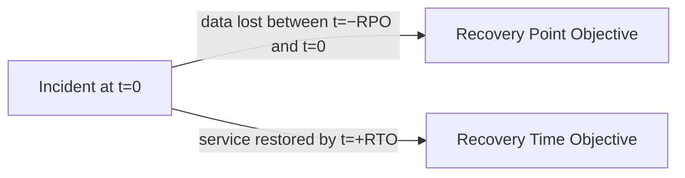
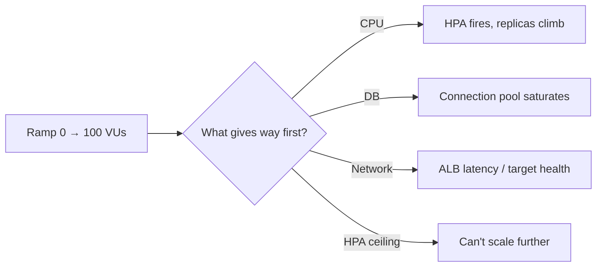
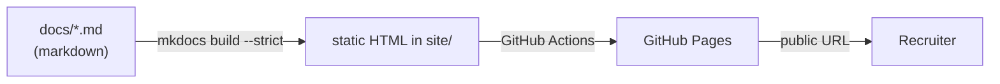

# Phase 8 Concept Brief — DR, Load, and Docs

> **Read this if you want to defend the portfolio as one that communicates as well as it works.**
> Time: ~15 min.
> **Goal:** prove three things at once — *"I know what recovery looks like, I know what the system breaks at, I can explain the whole portfolio without my laptop open."*

---

## Where Phase 7 left us



Three closing artefacts separate a "cool project" from a "production-thinking engineer's portfolio":

- A **DR runbook** that says what RPO and RTO actually mean for this system, and a tested recovery path.
- A **load test** with honest numbers and an identified bottleneck (not a vanity benchmark).
- A **docs site** that walks a recruiter through everything without them needing to clone the repo.

Phase 8 ships all three.

---

## The decision tree



---

## Sub-phase A — DR runbook

### Two numbers every DR plan starts with



- **RPO** — *Recovery Point Objective*. How much data are you willing to lose in the worst case? Driven by backup frequency / replication lag. For ShopForge: **RPO ≤ 5 min** (target — RDS PITR has 5-minute granularity).
- **RTO** — *Recovery Time Objective*. How long are you willing to be down? Driven by detection + restore time. For ShopForge: **RTO ≤ 30–45 min** (RDS restore from PITR is the long pole; everything else is fast).

These two numbers shape every infra decision. Want lower RPO? Continuous archiving + read replica. Want lower RTO? Pre-warmed standby instances. Both cost money. The portfolio settles for "honest enough" defaults and documents the upgrade path.

### The three scenarios

| Scenario | What happened | Recovery |
|----------|---------------|----------|
| **Accidental DELETE** | DBA runs `DELETE FROM orders` without `WHERE` | RDS PITR to `incident_time - 1 min`; promote to new instance; re-point DATABASE_URL secret; restart pods |
| **RDS instance lost** | EBS volume corrupted, instance unrecoverable | Restore from automated snapshot (if backups enabled) or PITR; same re-point + restart |
| **AZ outage** | ap-south-1a goes down | EKS nodes in 1b survive; HPA already keeps min=2 across AZs; RDS Multi-AZ would auto-failover (currently off — documented gap) |

### What was actually drilled vs documented

| Step | Status | Why |
|------|--------|-----|
| Detect incident on Grafana | drilled | Phase 6 alerts trigger |
| `kubectl scale deploy/backend --replicas=0` to stop traffic | drilled | one command |
| Restore RDS from PITR | **documented only** | would need backups enabled — explicit portfolio cut |
| Re-point DATABASE_URL secret to new endpoint | drilled | `kubectl edit secret + restart` |
| Restart backend pods | drilled | rolling restart |
| Verify with Grafana RED | drilled | dashboard exists |

**The drill matrix is in `docs/dr-runbook.md`** with explicit "drilled vs documented" markers. Honesty is the deliverable — pretending you tested a region failover you didn't would be the senior-engineer red flag.

---

## Sub-phase B — Load test

### What a load test is *for*

Not a vanity benchmark. The deliverable is *"we know where the system first breaks."*



The k6 script (`loadtest/k6-checkout.js`) ramps a list + detail + filter journey from 20 → 100 VUs over 8 minutes. Thresholds:

```javascript
thresholds: {
  http_req_duration: ['p(95)<800'],      // p95 latency under 800ms
  http_req_failed:   ['rate<0.01'],      // error rate under 1%
  content_checks_passed: ['rate>0.99'],  // 99% of payload checks pass
}
```

If any threshold breaks, k6 exits non-zero — usable as a future CI gate.

### What the live run actually found

```text
Total requests:    52,942
Failed:            0.00%
p95 latency:       34.93 ms
list_products p95: 39 ms
product_detail p95:30 ms
Content checks:    100%

HPA: 2 → 4 replicas (ceiling)
Backend CPU at peak: 244 % / 70 % target
```

**The honest finding:** the test exposed the HPA `maxReplicas` ceiling *before* it exposed any app or DB bottleneck. Backend CPU ran at 244 % of the 70 % target — HPA wanted to scale further but was capped. The real bottleneck (likely RDS connection pooling on a write-heavy workload) wasn't found because the test was read-only and the ceiling came first.

**Follow-up plan documented:** raise `maxReplicas` to 8, push to 200+ VUs, add a write-heavy stage (cart + checkout) — that's where RDS connection-pool exhaustion is the expected next limit.

This honest framing is the deliverable. *"My system handled 100 users with p95 35 ms"* is not as strong an answer as *"My system handled 100 users with p95 35 ms, but I found my HPA ceiling instead of my app's ceiling. Here's how I'd extend the test to find the real one."*

---

## Sub-phase C — Docs site

### MkDocs Material — markdown is the source



Three rules the docs follow:

1. **Markdown first.** Everything that's true about the system is also a sentence a recruiter can read. No Confluence, no Notion, no shared Google Doc.
2. **Diagrams are mermaid.** They version-control as text, they re-render automatically, they accept review comments in PRs.
3. **The site is auto-deployed.** A push to `main` that touches `docs/` triggers `.github/workflows/docs.yml`, which builds the site `--strict` (warnings fail the build) and publishes to GitHub Pages.

### What `--strict` mode buys you

In strict mode, MkDocs treats every warning as an error. The build fails if:

- A markdown link points to a non-existent page or anchor.
- An image reference points to a missing file.
- A nav entry references a non-existent file.

This caught two issues during Phase 8: a literal markdown image path inside a bash code block was being parsed as a real reference, and `concept-briefs/` was outside the nav but linked to. **Strict mode makes broken-doc PRs visible in CI, not in production.**

### The doc structure

```
docs/
├── index.md                    # home, hero, "what this demonstrates"
├── architecture.md             # system diagram, request lifecycle
├── recap.md                    # diagrammatic 8-phase walkthrough
├── load-test.md                # k6 results + screenshots
├── dr-runbook.md               # RPO/RTO + drilled vs documented matrix
├── chaos-gameday.md            # includes chaos/gameday-runbook.md via snippet
├── screenshots.md              # full gallery, grouped by phase
├── demo-script.md              # 4-min demo beat sheet
├── phases/                     # 9 short summaries (one per phase)
└── concept-briefs/             # 9 long-form "why this design" docs (this file's siblings)
```

---

## What we did *not* do, and why

| Cut | Why |
|-----|-----|
| Multi-region DR drill | Real region failure is unsafe to simulate; the cost-benefit doesn't work at portfolio scope. |
| RDS Multi-AZ / backups on | Cost. Flipping the three flags in `rds.tf` is a one-PR change to "real-production." |
| Write-heavy load stage | Would need test users + cart flows + cleanup. Read-heavy was enough to expose the HPA ceiling. |
| Recorded demo video | Optional. The docs site is the primary artefact; the video is the nice-to-have. |
| Tracing integration | At one service, traces ≈ logs. Worth adding for multi-service prod. |
| Cypress / Playwright E2E tests | The app is real but the test pyramid is portfolio-shaped — unit + lint + load. |

---

## Interview talking points

> **Q: "What's your RPO and RTO?"**
>
> "Target RPO is 5 minutes — that's the granularity of RDS PITR if backups are enabled. Target RTO is 30 to 45 minutes — restore is the long pole. In the *current* portfolio config, backups are off as a documented cost cut, so the real RPO is *the moment of the last good `pg_dump`*, which I don't have automated. The DR runbook calls this gap out explicitly."

> **Q: "What was the most surprising thing the load test found?"**
>
> "That I hit my own HPA ceiling before I hit any system bottleneck. At 100 VUs and 4 replicas, backend CPU was running at 244 % of the 70 % target — HPA wanted to scale to 5, 6, 7 replicas but couldn't because I'd capped `maxReplicas` at 4. The honest takeaway is that the test characterised my *configuration*, not my *app*. The follow-up is raising max and pushing to 200 VUs."

> **Q: "Why MkDocs Material for docs?"**
>
> "Three reasons. Markdown is the source — same review process as code. Mermaid diagrams are text, so diffs are readable. And `--strict` mode turns broken links and missing images into CI failures. The site is auto-deployed on every push to `main` via GitHub Actions and GitHub Pages."

> **Q: "Where would you fail if there were a region outage today?"**
>
> "Everywhere. The cluster, the RDS instance, the ALB, the ECR repo are all single-region. The DR runbook documents this as a known gap; recovery would mean re-running `terraform apply` in a new region with the latest snapshot, which is hours of downtime. Multi-region would mean active-passive RDS, Route 53 health-checked failover, and image replication. None of that's wired up — and saying so honestly is the *point* of the runbook."

> **Q: "Walk me through your load-test profile."**
>
> "Five stages over 8 minutes: ramp to 20 in 1 min, sustain 20 for 2 min, ramp to 100 in 1 min, hold 100 for 3 min, ramp down in 1 min. The sustained-20 stage is the baseline; the held-100 stage is where I expect HPA to fire. Each VU does list → detail → 1 s think time. I run the script from my laptop against the live ALB; results write to `loadtest/results.json` plus a text summary."

---

## When you actually understand Phase 8

You can answer this without thinking:

> *"You're hiring me to be the first SRE at a startup. Day 1, what artefact do I build that wasn't there yesterday?"*

The DR runbook. Not the dashboards, not the alerts, not the on-call rotation — those depend on knowing what *good* and *bad* look like. The DR runbook is the document that forces every other decision: *"if I'm woken up at 3 AM, what's the first command? Who knows the latest backup is current? Where do I look to confirm we're losing data?"* If those answers aren't written down, every other piece of operability is built on sand. **The runbook is the proof you're thinking like an operator.**
