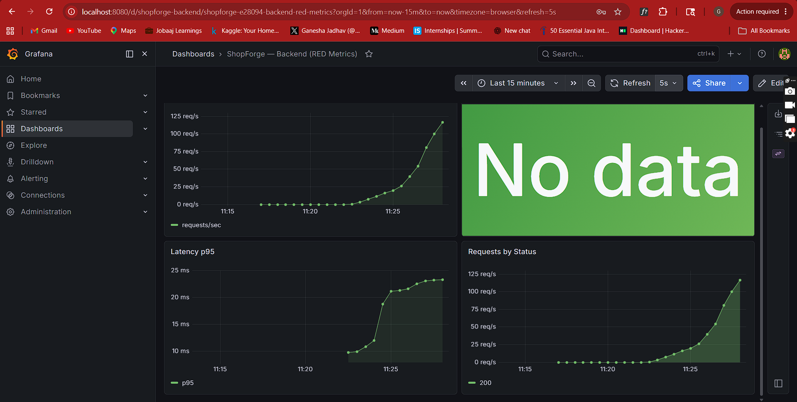
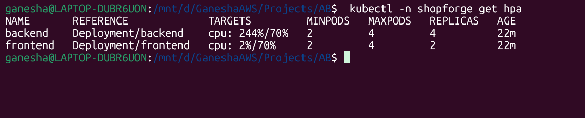
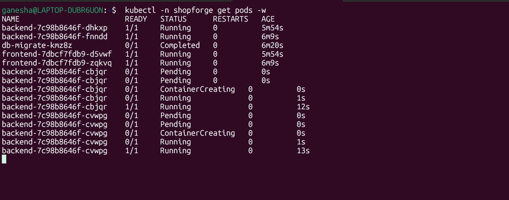
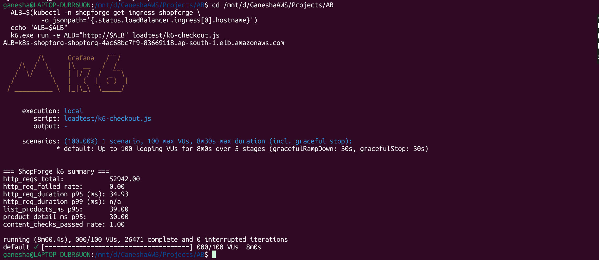

# Load Test

A k6 script exercises the live ShopForge ALB with a realistic browsing
journey, ramping to 100 concurrent users. The point isn't a benchmark
number — it's to *see HPA work* and to know where the system breaks first.

## What the test does

Each virtual user runs this loop:

1. `GET /api/v1/products` (list)
2. Pick a random product, `GET /api/v1/products/{id}` (detail)
3. `GET /api/v1/products?category=...` (filter)
4. 1s think time between iterations

## Ramp profile

| Stage             | Duration | Target VUs |
| ----------------- | -------- | ---------- |
| Ramp up           | 1 min    | 20         |
| Sustain           | 2 min    | 20         |
| Ramp up to peak   | 1 min    | 100        |
| Sustain peak      | 3 min    | 100        |
| Ramp down         | 1 min    | 0          |

**Total runtime:** ~8 minutes per run.

## Thresholds

```javascript
thresholds: {
  http_req_duration: ['p(95)<800'],   // p95 latency under 800ms
  http_req_failed:   ['rate<0.01'],   // error rate under 1%
  checks:            ['rate>0.99'],   // 99% of response-content checks pass
}
```

If any threshold is violated, k6 exits non-zero — usable as a CI gate in a
future iteration.

## How to run

See [`loadtest/README.md`](https://github.com/ganesha2208/three-tier-ecom/tree/main/loadtest)
for setup. The short version:

```bash
# Get the live ALB hostname
ALB=$(kubectl -n shopforge get ingress shopforge \
        -o jsonpath='{.status.loadBalancer.ingress[0].hostname}')

# Run from your laptop (k6 binary required)
k6 run -e ALB="http://$ALB" loadtest/k6-checkout.js
```

## What to watch on Grafana

Open the **ShopForge — Backend (RED Metrics)** dashboard before starting:

1. **Request rate** — should climb from ~0 to ~100 req/s during the peak
   stage.
2. **Backend HPA replicas** — should scale 2 → 4 during the peak; watch
   `kubectl -n shopforge get hpa backend -w` in another pane.
3. **p95 latency** — first response to load is a brief spike, then drops
   as new pods come online and absorb traffic.
4. **Error rate** — should stay flat at 0; if it climbs, the bottleneck is
   downstream (RDS connection pool exhaustion is the first usual suspect).

## Results

Live run on EKS 1.32 in `ap-south-1`, 27 May 2026. Cluster: 2× `m7i-flex.large`
nodes, backend HPA `min=2 max=4 cpu-target=70%`, RDS `db.t3.micro`.

| Metric              | Observed value |
| ------------------- | -------------- |
| Total requests      | **52,942** over 8 min |
| Peak request rate   | **~110 req/s** (see Grafana panel) |
| p95 latency         | **34.93 ms** (threshold was 800 ms — 23× headroom) |
| list_products p95   | 39 ms |
| product_detail p95  | 30 ms |
| Error rate          | **0.00 %** |
| Content checks      | **100 %** passed |
| HPA scale-up        | 2 → 4 replicas in ~2 min after the ramp-to-peak step |
| Replicas at peak    | **4 (HPA ceiling)** |
| Backend CPU at peak | **244 %** of the 70 % target — HPA wanted more replicas, capped at max |
| First bottleneck    | **HPA `maxReplicas` ceiling.** Even at 4 pods the backend was running hot. A production-tuning iteration would raise max to 8–10 and revisit the CPU target before declaring a true bottleneck. |

### Screenshots from the live run

**Grafana — request rate + p95 latency climbing during the peak hold**



**`kubectl get hpa` — backend at 244 % / 70 %, 4/4 replicas**

The HPA target was 70 %; the controller scaled to its `max=4` ceiling and
the pods kept running well above the target. This is the headline finding:
HPA fires correctly, but the configured ceiling is the real limit at this
load — not the app, not the DB.



**`kubectl get pods -w` — two extra backend pods spawning mid-test**



**k6 summary — all thresholds passed**



## Why this scope

100 VUs against a 2-pod backend on a t3.micro RDS isn't a Black Friday
test, and it shouldn't pretend to be. It's the *minimum honest load* to
see autoscaling fire and to learn which subsystem saturates first — which
is the *only* useful output of a portfolio load test.

## What the next iteration would change

The run exposed the HPA ceiling before it exposed the app's bottleneck. A
follow-up run would:

1. Raise `maxReplicas` to 8 (and the node group max) so HPA isn't the limit.
2. Push to 200–300 VUs so the per-pod CPU actually drops toward 70 %.
3. Add a write-heavy stage (cart + checkout) so RDS connection pooling
   comes under pressure — that's the likely next real bottleneck.
