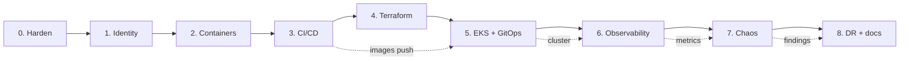

# Phases overview

The portfolio was built in **8 phases**, each scoped to one DevOps domain
and each ending with a real artefact — a passing pipeline, a live URL, a
dashboard screenshot, a recovery drill. No phase was marked complete on
paper alone.

| # | Phase | What shipped | Live? |
| --- | --- | --- | --- |
| 0 | [App hardening](phase-0.md) | Stable monolith baseline, health endpoints, fixed bugs | n/a |
| 1 | [Identity service](phase-1.md) | First service extraction (auth domain) | n/a |
| 2 | [Containers & supply chain](phase-2.md) | Multi-stage Dockerfiles, SBOMs, ECR | n/a |
| 3 | [DevSecOps CI/CD](phase-3.md) | GitHub Actions CI + CD, OIDC to AWS, image scan | ✅ green |
| 4 | [Terraform infra](phase-4.md) | VPC, EKS, RDS, ECR, IAM, IRSA — one-shot apply | ✅ |
| 5 | [EKS + GitOps](phase-5.md) | Cluster bootstrap, Argo CD, ALB controller, deployed app | ✅ live URL |
| 6 | [Observability](phase-6.md) | kube-prometheus-stack, Loki, Grafana, RED dashboard | ✅ live |
| 7 | [Chaos engineering](phase-7.md) | 4 experiments executed on live cluster | ✅ recorded |
| 8 | [DR, load test, docs](phase-8.md) | DR runbook, k6 load test, this site | 📄 |

## How the phases relate

Phases 4–7 require live AWS resources. The cluster was stood up and torn
down per session — total spend across all live work stayed under **$15**.
See each phase page for the per-phase cost and the teardown command.
