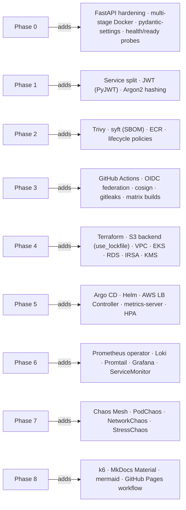
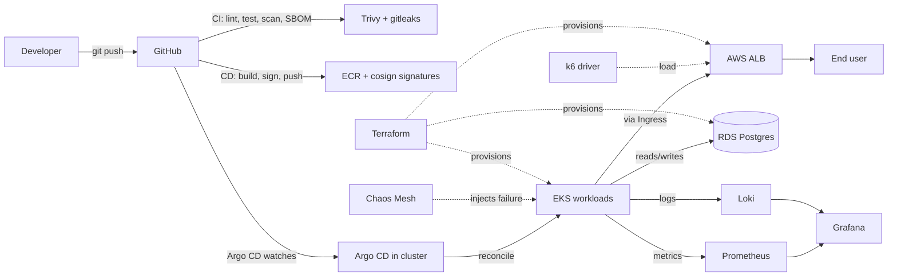

# Recap — 8 phases at a glance

A diagrammatic walkthrough of the whole portfolio: what was built in each
phase, why it mattered, and how the phases stack into one production-style
system.

## The 8-phase journey

```mermaid
flowchart TD
    subgraph App["App-level work"]
        P0["<b>Phase 0</b><br/>App hardening<br/>━━━━━━━<br/>Fix race conditions<br/>Remove default secrets<br/>Multi-stage Docker<br/>Health endpoints"]
        P1["<b>Phase 1</b><br/>Identity service<br/>━━━━━━━<br/>Auth domain split out<br/>JWT issuance<br/>Service template"]
    end

    subgraph Supply["Supply chain"]
        P2["<b>Phase 2</b><br/>Containers + supply chain<br/>━━━━━━━<br/>Multi-stage Dockerfiles<br/>Trivy scans<br/>SBOM (syft)<br/>ECR repos"]
        P3["<b>Phase 3</b><br/>DevSecOps CI/CD<br/>━━━━━━━<br/>GitHub Actions CI<br/>OIDC to AWS (keyless)<br/>cosign image signing<br/>gitleaks secret scan"]
    end

    subgraph Infra["Cloud infra"]
        P4["<b>Phase 4</b><br/>Terraform infra<br/>━━━━━━━<br/>VPC + 2-AZ subnets<br/>EKS 1.32 + node group<br/>RDS Postgres 16<br/>IRSA, KMS, S3 backend"]
        P5["<b>Phase 5</b><br/>EKS + GitOps<br/>━━━━━━━<br/>metrics-server + LB Ctrl<br/>Argo CD app-of-apps<br/>Live ALB → app<br/>HPA configured"]
    end

    subgraph Ops["Production discipline"]
        P6["<b>Phase 6</b><br/>Observability<br/>━━━━━━━<br/>kube-prometheus-stack<br/>Loki + Promtail<br/>RED dashboard<br/>3 alert rules"]
        P7["<b>Phase 7</b><br/>Chaos engineering<br/>━━━━━━━<br/>Pod kill, net delay,<br/>CPU stress, 50% fail<br/>Game day runbook"]
        P8["<b>Phase 8</b><br/>DR + load + docs<br/>━━━━━━━<br/>DR runbook (RPO/RTO)<br/>k6 — 52,942 reqs<br/>MkDocs site<br/>Demo script"]
    end

    P0 --> P1 --> P2 --> P3 --> P4 --> P5 --> P6 --> P7 --> P8

    classDef appStyle fill:#e0f2fe,stroke:#0369a1,color:#0c4a6e
    classDef supplyStyle fill:#fef3c7,stroke:#b45309,color:#78350f
    classDef infraStyle fill:#dcfce7,stroke:#15803d,color:#14532d
    classDef opsStyle fill:#fce7f3,stroke:#be185d,color:#831843
    class P0,P1 appStyle
    class P2,P3 supplyStyle
    class P4,P5 infraStyle
    class P6,P7,P8 opsStyle
```

## What new tech each phase introduced

## Per-phase deep table

| # | Phase | Why this phase | Tech added | Key files | Artifact |
|---|-------|----------------|------------|-----------|----------|
| **0** | App hardening | Don't split broken code into 5 broken services. Get a defensible baseline first. | FastAPI, pydantic-settings, multi-stage Docker | `backend/app/`, `frontend/Dockerfile` | Stable monolith + 9 documented fixes |
| **1** | Identity service | First service extraction — proves the split is feasible without breaking the app. | JWT, Argon2 password hashing | `services/identity/` | Auth API running as its own service |
| **2** | Containers + supply chain | Production images need to be small, scanned, and traceable. | Trivy, syft (SBOM), ECR | `services/*/Dockerfile`, `sbom/` | Signed images in ECR with SBOM artifacts |
| **3** | DevSecOps CI/CD | Manual pushes don't scale; secrets in workflows are a footgun. | GitHub Actions, OIDC federation, cosign, gitleaks | `.github/workflows/ci.yml`, `cd.yml` | Green pipeline on every commit; OIDC role-assumed to AWS — zero long-lived keys |
| **4** | Terraform infra | Click-ops infra isn't reviewable, isn't reproducible, isn't a portfolio piece. | Terraform, EKS module, VPC module, RDS, IRSA, KMS | `infra/terraform/*.tf` | Single `terraform apply` brings up the whole stack |
| **5** | EKS + GitOps | Reconciliation > push. `kubectl apply` on a laptop is not a deploy strategy. | Argo CD, Helm, AWS LB Controller, metrics-server | `gitops/bootstrap.sh`, `gitops/apps/shopforge/` | App live behind ALB; Argo CD auto-syncs from git |
| **6** | Observability | You can't operate what you can't see. RED is the minimum honest baseline. | kube-prometheus-stack, Loki, Promtail, Grafana, ServiceMonitor | `observability/install.sh`, `observability/dashboards/` | RED dashboard, log search in Grafana, 3 alert rules |
| **7** | Chaos engineering | Resilience claims need drills. Game days build muscle memory. | Chaos Mesh (PodChaos, NetworkChaos, StressChaos) | `chaos/experiments/*.yaml`, `chaos/gameday-runbook.md` | 4 experiments executed with before/during/after observations |
| **8** | DR + load + docs | A portfolio that doesn't communicate is wasted work. Recovery + load test + a docs site close the loop. | k6, MkDocs Material, GitHub Pages workflow | `loadtest/k6-checkout.js`, `mkdocs.yml`, `.github/workflows/docs.yml` | DR runbook, live k6 results, this docs site |

## End-state architecture (what all 8 phases combine into)

## How to read this portfolio for an interview

If a recruiter or interviewer asks *"walk me through your project"*, the
honest 90-second answer is:

1. **App-level (P0–P1)** — I started with a working monolith and made it
   deployable safely before doing anything else.
2. **Supply chain (P2–P3)** — every image that hits production is built
   by CI, scanned, signed, and pushed via OIDC. There are no long-lived
   AWS keys anywhere in the system.
3. **Infra (P4–P5)** — every piece of cloud is Terraform; every Kubernetes
   object is in git; Argo CD reconciles. There is no "click in the console"
   step.
4. **Production discipline (P6–P8)** — I can see the system (Prometheus
   + Loki), I've broken it on purpose to learn how it fails (Chaos Mesh),
   and I know how I'd recover from a real incident (DR runbook + k6
   numbers + screenshots, not just claims).

If they want to go deeper on any layer, the [phase pages](phases/index.md)
have the per-phase write-ups, and the [concept briefs](concept-briefs/phase-0.md)
have the "why this design" reasoning.

## What was deliberately cut

| Cut | Why |
|-----|-----|
| Multi-region failover | Cost. Documented as theory in the [DR runbook](dr-runbook.md). |
| RDS Multi-AZ + backups | Cost + portfolio scope. Documented as a known prod gap. |
| Argo CD Image Updater | Manual tag bump is a deliberate human gate — defensible in interviews. |
| Service mesh (Istio/Linkerd) | RED dashboard + HPA at this scale don't need it. Would be next iteration. |
| Production WAF + Shield | Not a portfolio differentiator; well-trodden territory. |

The cuts are as important as the build — they show scope judgement.
