# Screenshots gallery

Visual artefacts captured during live runs on the EKS cluster
(ap-south-1). Each section is grouped by phase; click any image to view
full size.

---

## Phase 4 — Terraform state in S3

**What:** the remote state for the EKS+RDS infra lives in an S3 bucket
(`shopforge-tfstate-<account-id>`) with `use_lockfile` enabled — the
Terraform 1.10+ S3-native locking, no DynamoDB table needed.

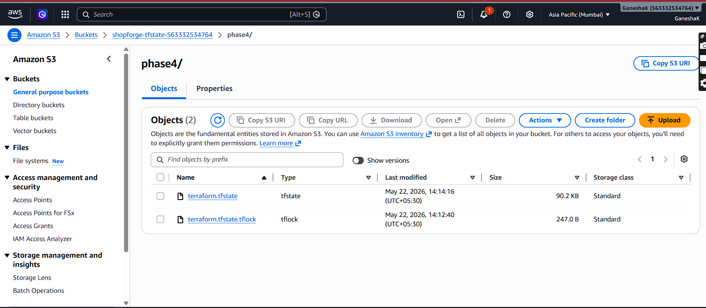

---

## Phase 5 — App live on EKS via GitOps

### The storefront

**What:** the React storefront served from a frontend pod in EKS, fronted
by an AWS ALB the LB Controller provisioned from the Ingress object.

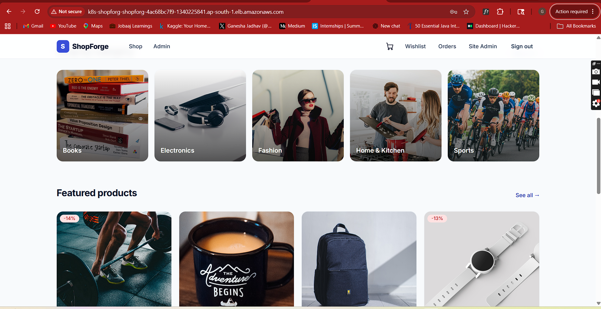

### Argo CD application — details view

**What:** the `shopforge` Argo CD `Application` reporting `Healthy` and
`Synced`. Auto-sync is enabled; the most recent reconcile pulled
commit `a1f9834` from `main`.

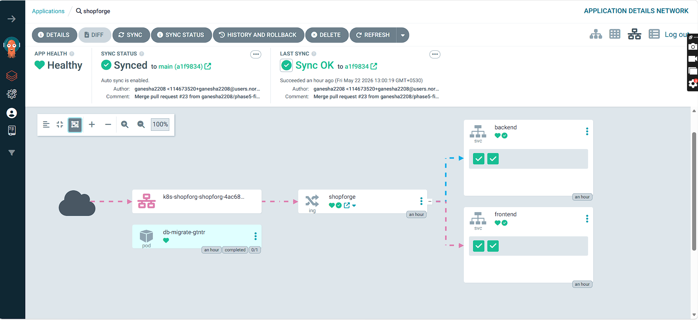

### Argo CD application tree

**What:** the full resource tree as Argo CD reconciles `gitops/apps/shopforge/`
into the cluster — Deployments, Services, ConfigMap, Ingress, HPAs, and the
db-migrate Job, all green.

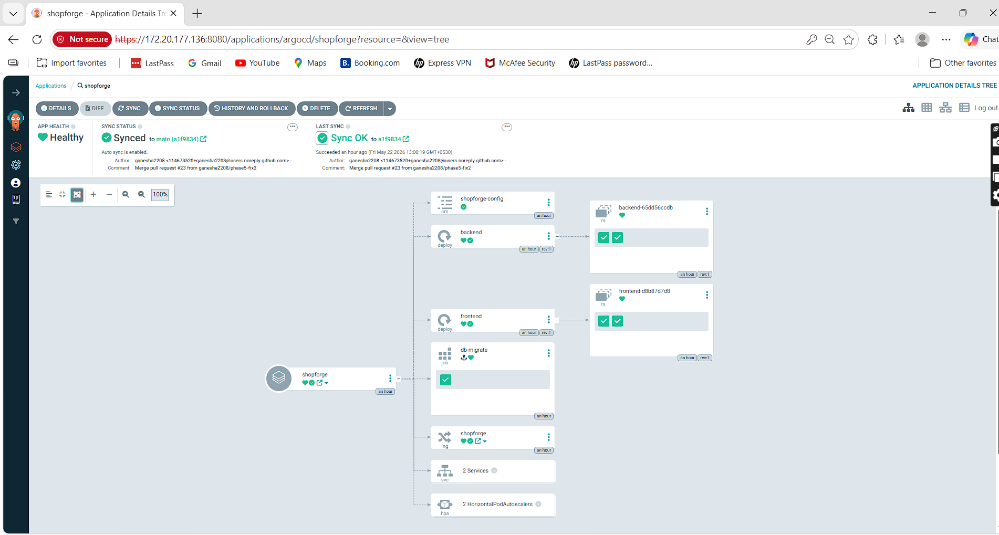

### Cluster resources view

**What:** `kubectl -n shopforge get pods,svc,ingress,hpa` showing everything
the gitops sync produced — 2 backend pods + 2 frontend pods running, the
db-migrate Job completed, the ALB hostname populated, both HPAs at
`MINPODS=2 MAXPODS=4`, baseline CPU 2 %.

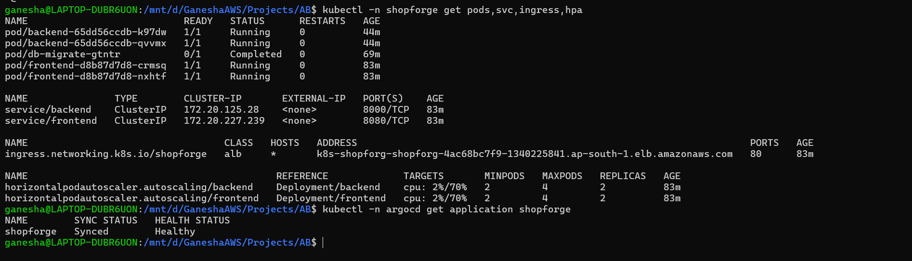

---

## Phase 6 — Observability

### RED dashboard at baseline

**What:** the **ShopForge — Backend (RED Metrics)** dashboard at steady
background load. Request rate ~1.5 req/s, p95 latency ~20–30 ms, zero
errors (so the "Error Rate (5xx %)" panel shows "No data" — *as expected*).
This is the reference shape every chaos drill is measured against.

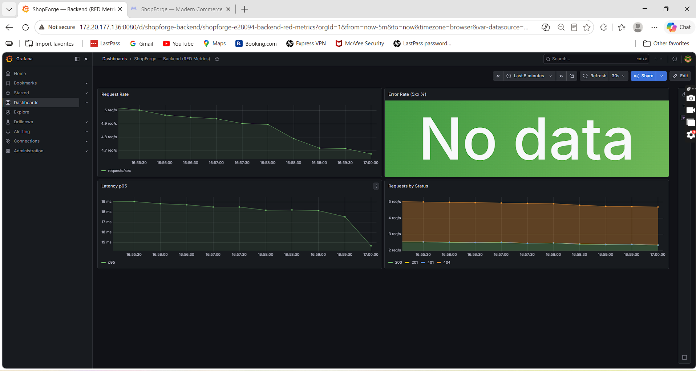

### Logs in Loki

**What:** the Loki Explore view inside Grafana, querying structured JSON
logs from backend pods. Filterable by label (`namespace=shopforge`,
`app=backend`), no extra agent setup beyond Promtail.

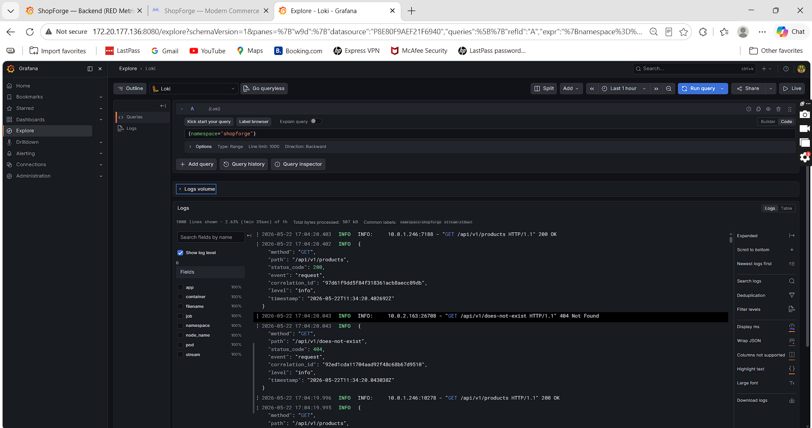

### Alert rules

**What:** the Alerting view showing both the Grafana-managed alerts and the
Prometheus rules loaded via the `PrometheusRule` CRD — ShopForge-specific
rules plus the kube-prometheus-stack defaults.

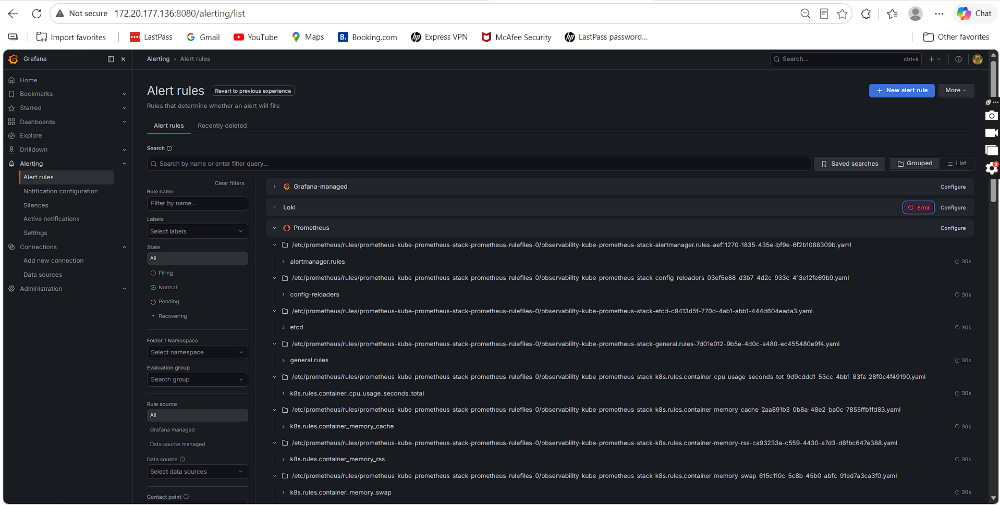

---

## Phase 7 — Chaos engineering drills

All four experiments were run on a live cluster against the steady
background load shown above. The full per-experiment commentary is in the
[Chaos game day runbook](chaos-gameday.md); these screenshots are the
visual evidence.

### Pre-chaos baseline

**What:** the RED dashboard shape just before injecting failure — request
rate and latency at the steady baseline, error rate panel still
showing "No data". This is the "before" frame for the experiments below.

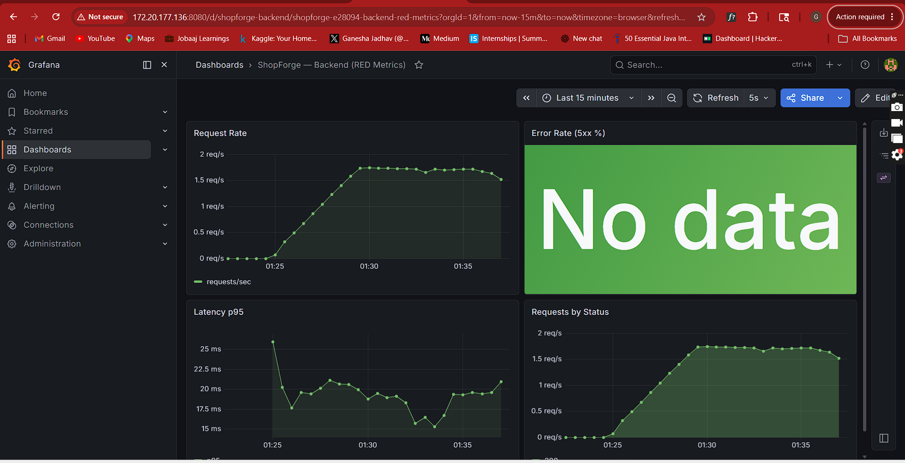

### Experiment 1 — Pod kill

**What:** the dashboard during the `PodChaos` pod-kill experiment.
Backend replicas were terminated and recreated by the Deployment
controller; the dashboard shows a small dip in request rate that recovers
within a heartbeat.

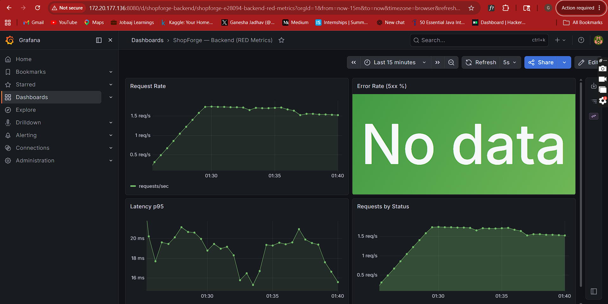

### Experiment 2 — Network delay to RDS

**What:** `NetworkChaos` injecting latency to the RDS endpoint. p95
latency curve climbs, then snaps back to baseline once the chaos
resource is removed.

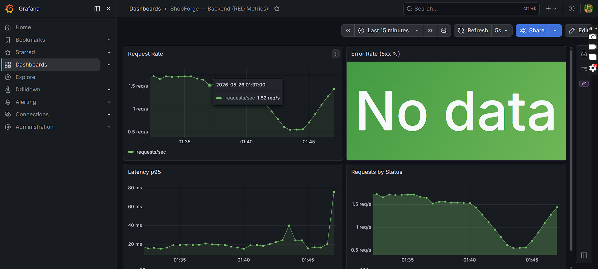

### Experiment 3 — CPU stress → HPA scale-up

**What:** `StressChaos` driving backend CPU through the roof. The HPA
output shows the controller reacting in real time —
**`TARGETS` climbs 7 % → 272 % → 501 % → 333 % → 253 %**, and
`REPLICAS` ticks from 2 → 4 once the target is crossed. This is the
"HPA actually works" proof shot.

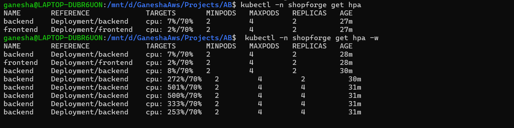

### Experiment 4 — 50 % pod failure (apply)

**What:** half the backend pods rendered unschedulable by
`PodChaos` `action: pod-failure`. The same terminal shows a
20-iteration `curl` loop against the ALB — every probe returns HTTP
**200**. Surviving pods carried the full load, zero user-visible
downtime.

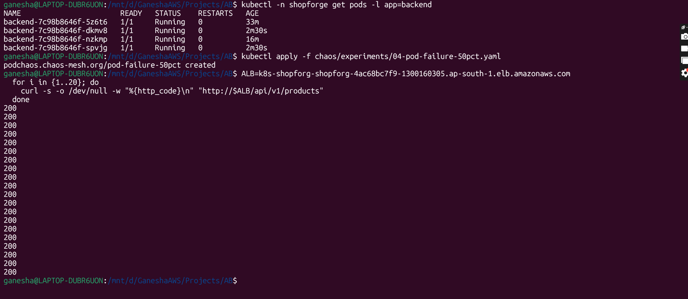

### Experiment 4 — dashboard during failure

**What:** the Grafana view during the 50 % failure window — request rate
unchanged, latency briefly elevated, error rate flat at zero.

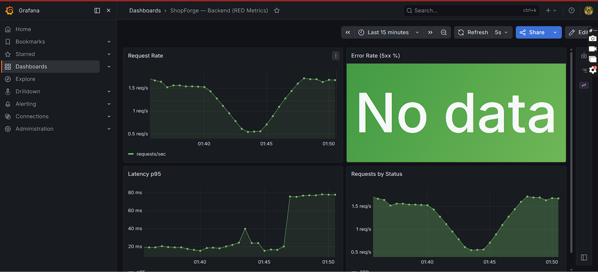

### Experiment 4 — recovery

**What:** the PodChaos resource removed; pods return to Ready. The
RESTARTS column on two pods shows `4 (21s ago)` and `3 (21s ago)` — the
audit trail of the chaos drill — and a fresh curl loop still returns
all 200s.

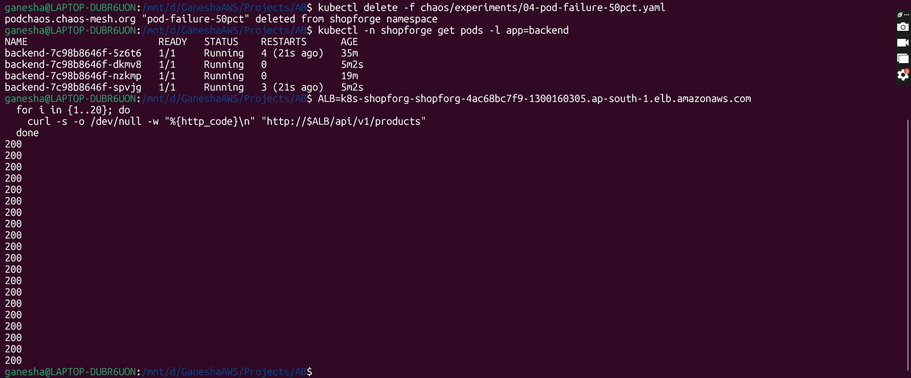

### Post-recovery dashboard

**What:** the RED dashboard returning to baseline after the chaos
window closes — latency settles, request rate stable, error rate
still zero.

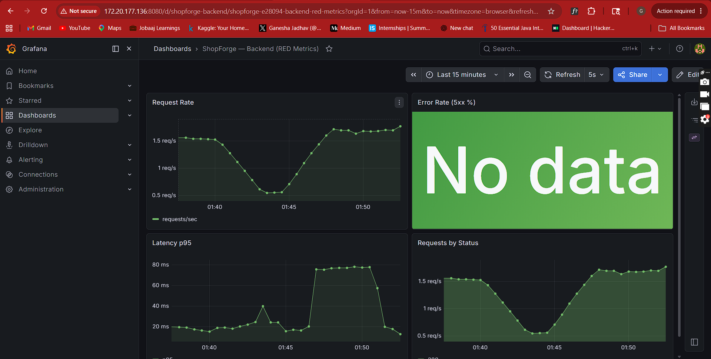

---

## Phase 8 — Load test under k6

The full numbers + thresholds + follow-up plan live on the
[load-test page](load-test.md); these are the captures that page
references.

### Grafana — request rate + p95 climbing under k6


### `kubectl get hpa` — backend at 244 % / 70 %, 4 / 4 replicas

The HPA target was 70 %; the controller scaled to its `max=4` ceiling
and the pods kept running well above target. **The HPA ceiling was the
first limit hit**, not the app and not the DB.


### `kubectl get pods -w` — extra backend pods spawning


### k6 summary — all thresholds passed

52,942 requests, p95 34.93 ms, zero failures, 100 % content checks
passed.


---

## How to add a screenshot

```bash
# 1. Drop the PNG into the appropriate phase folder
cp ~/Pictures/my-capture.png docs/images/phase-7/09-new-experiment.png

# 2. In this file, add a short section with the embed
#    

# 3. Preview locally
mkdocs serve

# 4. Commit
git add docs/images/phase-7/09-new-experiment.png docs/screenshots.md
git commit -m "docs: add screenshot for new chaos experiment"
```
